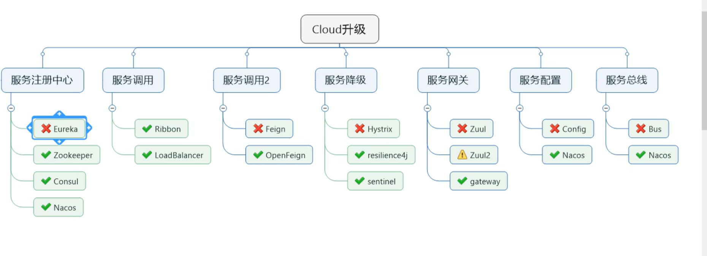

# cloud

## 微服务架构


##  2.2.x 和 H 版

### 简介

本次的SpringCloud第二季分为上半场和下半场

上篇
	SpringBoot2.X版和SpringCloud H版
下篇
	SpringCloud Alibaba

### 目录




### Springboot版本选择
​	git源码地址：
​		https://github.com/spring-projects/spring-boot/releases/
​	SpringBoot2.0新特性：
​		https://github.com/spring-projects/spring-boot/wiki/Spring-Boot-2.0-Release-Notes
​	通过上面官网发现，Boot官方强烈建议你升级到2.X以上版本
​	官网看Boot版本 
​		 springboot(截至2019.10.26)
​		springboot(截至2020.2.15)
### SpringCloud版本选择
​	git源码地址
​		https://github.com/spring-projects/spring-cloud/wiki
​	官网：
​		https://spring.io/projects/spring-cloud
​	官网看Cloud版本 
​		Cloud命名规则
​		springcloud(截至2019.10.26)
​		springboot(截至2020.2.15)

### SpringCloud和Springboot之间的依赖关系如何看

- https://spring.io/projects/spring-cloud#overview
- 依赖
- 更详细的版本对应查看方法

  - https://start.spring.io/actuator/info

  - 查看json串返回结果

### 环境

```
- cloud：Hoxton.SR1

- boot：2.2.2.RELEASE

- cloud Alibaba：2.1.0.RELEASE

- java： JAVA8

- maven： 3.5及以上

- mysql：5.7及以上

- 不许捣蛋，上述全部版本必须和阳哥一致
- 题外话
	-boot版已经到2.2.4为最新，为什么选2.2.2？
    - 只用boot，直接用最新
      - Subtopic
    - 同时用boot和cloud，需要照顾cloud，由cloud决定boot版本
      - 结果
    - SpringCloud和SpringBoot版本对应关系
  - 2.X版本常用的组件pom
```


## Cloud各种组件的停更/升级/替换

### 由停更引发的“升级惨案”

- 停更不停用

  - 被动修复bugs
  - 不再接受合并请求
  - 不再发布新版本

- 明细条目

  - 以前
  - now2020


### 参考资料见官网
​	Spring Cloud
​		https://cloud.spring.io/spring-cloud-static/Hoxton.SR1/reference/htmlsingle/
​		Spring Cloud中文文档
​			https://www.bookstack.cn/read/spring-cloud-docs/docs-index.md
​	Spring Boot
​		https://docs.spring.io/spring-boot/docs/2.2.2.RELEASE/reference/htmlsingle/


## 微服务结构编码构建

约定 > 配置 > 编码


### idea 项目构建

微服务cloud整体聚合父工程Project
	父工程步骤
		1.New Project（Maven site project）
		2.聚合总工程名字
		3.Maven选版本
		4.工程名字
		5.字符编码(项目所有编码使用utf-8)
		6.注解生效激活(setting)
		7.java编译版本选8(idea 默认配置中设置)
		8.File Type过滤

父工程POM

​	https://github.com/x-emory/cloud/blob/master/pom.xml

​	Maven中的dependencyManagement和dependencies 来管理子模块下所有dependencies 版本

​	maven中跳过单元测试（idea 右侧栏maven勾中闪电）

父工程创建完成执行mvn:install将父工程发布到仓库方便子工程继承


#### Rest 微服务项目构建

构建步骤

- ​	构建xxx微服务提供者Module模块，构建完回父工程看下pom文件变化
- ​	写pom
- ​	写yaml
- ​	主启动
- ​	业务编码 --	SQL -> entitles -> dao -> servicve -> controller

构建完成一个模块后进行测试

​	可以通过chrome插件

​	通过 postman

运行

​	idea 中开启多个项目会自动提示是否要开启Run DashBoard窗口

​		如果`没有开启`可以通过修改idea的workpace.xml的方式来快速打开Run DashBoard窗口

​	部分idea版本不同可能需要重启


#### 热部署

boot也有一套热部署方案 

​		热部署：idea，Springboot推荐Spring-boot-devtools来实现热部署。+ 快捷键 ctrl+F9


cloud:

1.Adding devtools to your project

2.Adding plugin to your pom.xml

```xml
<plugin>
    <groupId>org.springframework.boot</groupId>
    <artifactId>spring-boot-maven-plugin</artifactId>
    <configuration>
    <fork>true</fork>
    <addResources>true</addResources>
    </configuration>
</plugin>
```

3.Enabling automatic build (compiler select adbc)

4.Update the value of

5.重启IDEA

idea 中 ctrl+shift+alt+/ 选中 xxx...app.running 和 xxx...assertFocusAccessFormat	-直接搜索选中即可


#### 微服务消费者Module模块

构建步骤

- ​	构建xxx微服务提供者Module模块，构建完回父工程看下pom文件变化
- ​	写pom
- ​	写yaml
- ​	主启动
- ​	业务编码 -- 调用提供者提供服务
  ​	RestTemplate
  ​		是什么：类似于JdbcTempleate..
  ​		官网及使用:
  - https://docs.spring.io/spring-framework/docs/5.2.2.RELEASE/javadoc-api/org/springframework/web/client/RestTemplate.html
  - config配置类
    		ApplicationContextConfig:https://github.com/x-emory/cloud/blob/master/cloud-consumer-order80/src/main/java/com/emory/springcloud/config/ApplicationContextConfig.java
    	创建controller

测试

不要忘记@RequestBody注解


#### 项目重构

问题：系统中重复部分，重构

将重复部分抽取出来：创建一个新的cloud-api-commons modles 存放

​	POM

```xml
   <!-- https://mvnrepository.com/artifact/org.springframework.boot/spring-boot-devtools -->
        <dependency>
            <groupId>org.springframework.boot</groupId>
            <artifactId>spring-boot-devtools</artifactId>
            <scope>runtime</scope>
            <optional>true</optional>
        </dependency>
        <dependency>
            <groupId>org.projectlombok</groupId>
            <artifactId>lombok</artifactId>
            <optional>true</optional>
        </dependency>        <!-- https://mvnrepository.com/artifact/cn.hutool/hutool-all -->
        <dependency>
            <groupId>cn.hutool</groupId>
            <artifactId>hutool-all</artifactId>
            <version>5.1.0</version>
        </dependency>
```

​	entities
​		Payment实体
​		CommonResult通用封装类
​	maven命令clean install

订单80和支付8001分别改造
	删除各自的原先有过的entities文件夹
	各自黏贴POM内容

```xml
<dependency>
            <groupId>com.emory.springcloud</groupId>
            <artifactId>cloud-api-commons</artifactId>
            <version>0.0.1-SNAPSHOT</version>
</dependency>
```

总结：将冗余可以共享的部分抽取出来一个新的模块，通过maven 打包后其它模块引用即可


