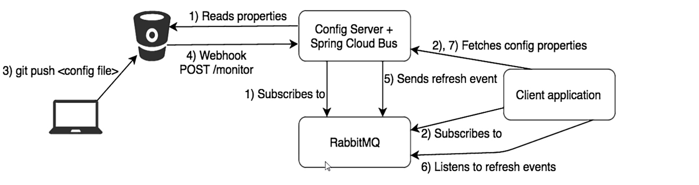

# Bus 消息总线

## 简介

[官网地址](https://spring.io/projects/spring-cloud-bus#overview)

Spring Cloud Bus 是用来将分布式系统的节点与轻量级消息系统链接起来的框架，它整合了Java的**事件处理机制**和**消息中间件的功能**。**分布式自动刷新配置功能**，**Spring Cloud Bus配合Spring Cloud Config使用可以实现配置的动态刷新**。Bus支持两种消息代理：RabbitMQ和Kafka


功能：

Bus 能管理和传播分布式系统间的消息，就像一个分布式执行器，可用于广播状态更改、时间推送等，也可以当做微服务间的通信通道。

为什么成为总线？

在微服务架构的系统中，通常会使用轻量级的消息代理来构建一个共用的消息主题，并让系统中所有微服务实例都连接上来。由于该主题中产生的消息会被所有实例监听和消费，所以称它为消息总线。在总线上的各个实例，都可以方便地广播一些需要让其他连接在该主题上的实例都知道的消息。

基本原理：

ConfigClient实例都监听MQ中同一个topic，默认是springCloudBus。当一个服务刷新数据时，它会把这个信息放入到Topic中，这样其他监听同一个Topic的服务就能得到通知，然后去更新自身的配置。


## RabbitMQ环境配置

1. 安装Erlang，[下载地址](http://erlang.org/download/otp_win64_21.3.exe)

2. 安装RabbitMQ，[下载地址](https://dl.bintray.com/rabbitmq/all/rabbitmq-server/3.7.14/rabbitmq-server-3.7.14.exe)

   进入 sbin 目录，输入以下命令启动管理功能，启用可视化插件

   ```shell
   rabbitmq-plugins enable rabbitmq_management
   ```

   在 开始 菜单里查找 `RabbitMQ Service - start`，启动服务

   访问 Url `http://localhost:15672/`，`guest` / `guest`


## SpringCloud Bus动态刷新全局广播

1. 必须先具备良好的RabbitMQ环境先（或Kafka）

2. 演示广播效果，增加复杂度，再以3355为模板再制作一个3366

3. 设计思想：

    利用消息总线触发一个客户端/bus/refresh,而刷新所有客户端的配置

    利用消息总线触发一个服务端ConfigServer的 `/bus/refresh` 端点,而刷新所有客户端的配置（更加推荐）

   例如：告诉一个人让其互传，或者通过开会方式一个人广播给所有人。显然第二种方式更加合适，第一种打破了微服务的职责单一性，破坏了各个节点的对等性，更为致命的存在一定局限性，如果微服务迁移时，网络地址发生变化如果向自动刷新那就会增加更多修改。

4. 给 cloud-config-center-3344 **配置中心服务端**添加消息总线支持

   添加依赖

   ```xml
   <dependency>
       <groupId>org.springframework.cloud</groupId>
       <artifactId>spring-cloud-starter-bus-amqp</artifactId>
   </dependency>
   ```

   写yml

   ```yaml
   #rabbitmq相关配置 其实这默认自动配置了
   spring:
     rabbitmq:
       host: localhost
       port: 5672
       username: guest
       password: guest
     
   ##rabbitmq相关配置,暴露bus刷新配置的端点
   management:
     endpoints: #暴露bus刷新配置的端点
       web:
         exposure:
           include: 'bus-refresh'
   ```

   给 cloud-config-center-3355、cloud-config-center-3366 **客户端添加消息总线支持**

   ​	pom

   ```xml
   <dependency>
       <groupId>org.springframework.cloud</groupId>
       <artifactId>spring-cloud-starter-bus-amqp</artifactId>
   </dependency>
   ```

   ​	yml

   ```yaml
   #rabbitmq相关配置
   spring:
     rabbitmq:
       host: localhost
       port: 5672
       username: guest
       password: guest
   ```

   

测试

1. RabbitMQ 就绪（启动）
2. 启动注册中心，cloud-eureka-server7001
3. 启动配置中心，cloud-config-center-3344
4. 启动配置客户端，cloud-config-client-3355，cloud-config-client-3366
5. 分别通过配置中心和客户端访问配置，此时配置都是最新的，配置中心与客户端获取到的配置相同

```
http://localhost:3344/master/config-dev.yml
http://localhost:3355/configInfo
http://localhost:3366/configInfo
```

6. 修改 GitHub 上的配置，再次访问。此时通过配置中心访问到的是最新的，客户端的配置没有改变
7. 动态刷新全局广播：POST 请求访问 `http://localhost:3344/actuator/bus-refresh`，一次发送处处生效


## SpringCloud Bus动态刷新定点通知

不想全部通知，只通知某些服务。

> 公式：http://localhost:配置中心的端口号/actuator/bus-refresh/{destination}

请求不再发送到具体的服务实例上，而是发给config server并通过destination参数类指定需要更新配置的服务或实例

> 例如：http://localhost:3344/actuator/bus-refresh/config-client:3355





