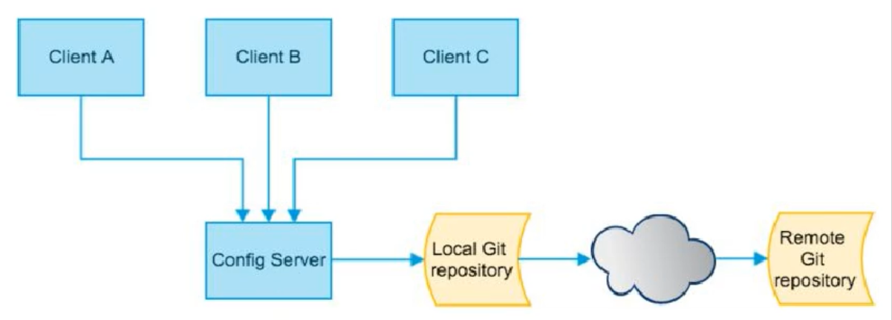
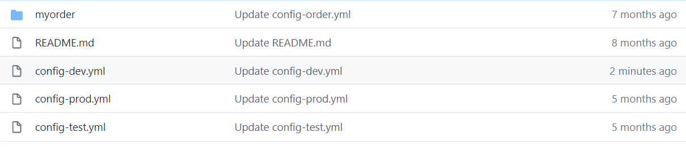
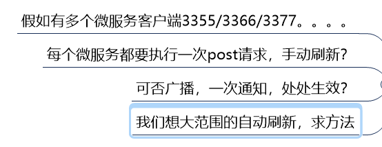

# 分布式配置中心

## 简介

> config

分布式系统面临的问题

拆分的每个服务都需要一个配置信息才能运行，项目大了几百个配置文件的管理...哭晕

衍生出 Config 中心化配置，去中心化


> 功能

集中式管理配置文件

不同环境不同配置，动态化的配置更新，分环境部署比如dev/test/prod/beta/release

运行期间动态调整配置，不再需要在每个服务部署的机器上编写配置文件，服务会向配置中心统一拉取配置自己的信息

当配置发生变动时，服务不需要重启即可感知到配置的变化并应用新的配置

将配置信息以REST接口的形式暴露，post、curl访问刷新均可....


> 于 Github 整合配置

由于SpringCloud Config默认使用Git来存储配置文件（也有其它方式，比如支持svn和本地文件，但最推荐的还是Git，而且使用的是http/https访问的形式）

[官网](https://cloud.spring.io/spring-cloud-static/spring-cloud-config/2.2.1.RELEASE/reference/html/)




## Config 服务端配置

创建一个Github 仓库用于管理 config，此处类似于 Maven 环境隔离




步骤

- 建Module，cloud-config-center-3344

- **pom**

  ```xml
  <dependency>
      <groupId>org.springframework.cloud</groupId>
      <artifactId>spring-cloud-config-server</artifactId>
  </dependency>
  
  ```

- **yml**

  ```yaml
  server:
    port: 3344
  spring:
    application:
      name: cloud-config-center
    cloud:
      config:
        server:
          git:
            uri: https://github.com/x-emory/springcloud-config.git
  #          search-paths:
  #            - springcloud-config
        label: master # 分支
  eureka:
    client:
      service-url:
        defaultZone:  http://localhost:7001/eureka
  
  
  ```

- 主启动：**@EnableConfigServer**

- 测试：http://localhost:3344/master/configclient-dev.yml


#### 配置读取规则

- `/{application}/{profile}[/{label}]`
- `/{application}-{profile}.yml`
- `/{label}/{application}-{profile}.yml`
- `/{application}-{profile}.properties`
- `/{label}/{application}-{profile}.properties`

label：分支 （branch）

profile：环境


## Config 客户端配置

新建cloud-config-client-3355

pom

```xml
<dependency>
    <groupId>org.springframework.cloud</groupId>
    <artifactId>spring-cloud-starter-config</artifactId>
</dependency>
```

bootstrap.yml

```yaml
server:
  port: 3355

spring:
  application:
    name: config-client
  cloud:
    config:
      label: master
      name: config
      profile: dev
      uri: http://localhost:3344 #配置中心地址
eureka:
  client:
    service-url:
      defaultZone: http://eureka7001.com:7001/eureka
```

application.yml 是用户级的资源配置项

bootstrap.yml 是系统级的，优先级更高

Spring Cloud 会创建一个 Bootstrap Context，作为 Application Context 的父上下文。初始化的时候，Bootstrap Context 负责从外部源加载配置属性并解析配置。这两个上下文共享一个从外部获取的 Environment。

Bootstrap 属性有高优先级，默认情况下，它们不会被本地覆盖。Bootstrap Context 和 Application Context 有着不同的约定，所以新增 bootstrap.yml，保证配置分离。

bootstrap.yml 先于 application.yml 加载。


业务类

```java
@RestController
public class ConfigClientController {
    @Value("${my.name}")
    private String configInfo;

    @GetMapping("/configInfo")
    public String getConfigInfo() {
        return configInfo;
    }
}
```

测试，`http://localhost:3355/configInfo`

改变Git里配置的内容后，从3344服务端读取到更新后的内容，3355客户端仍然是改变前的内容


## Config客户端之动态刷新

1. 写yml

```yaml
# 暴露监控端点
management:
  endpoints:
    web:
      exposure:
        include: "*"
```

2. 业务类添加注解 `@RefreshScope`
3. Git 更改后，发送 Post 请求，`localhost:3355/actuator/refresh`

> 还存在的问题



后续


