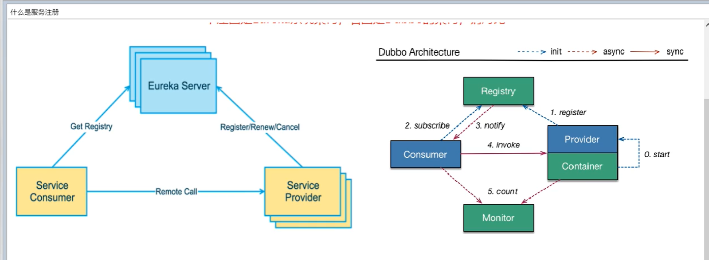
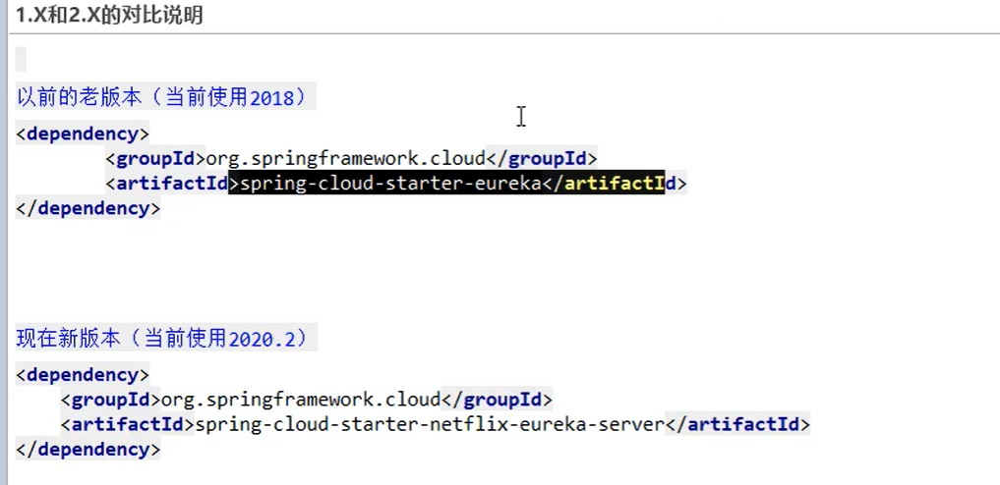
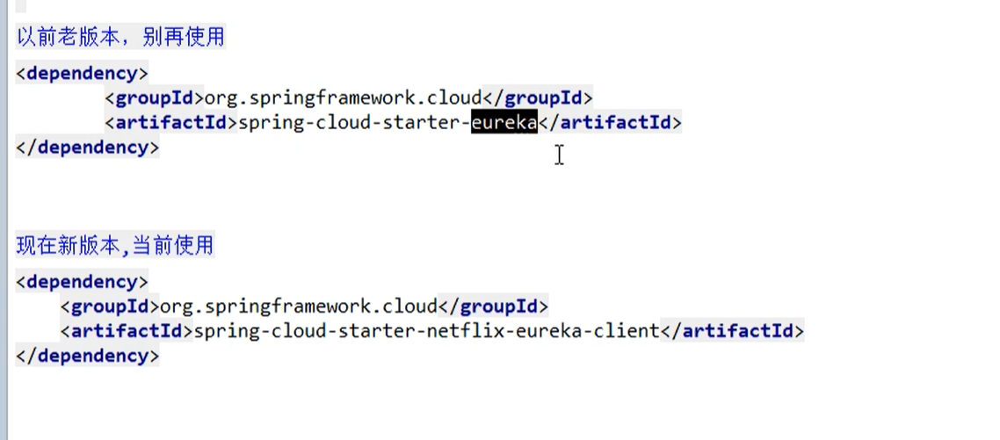
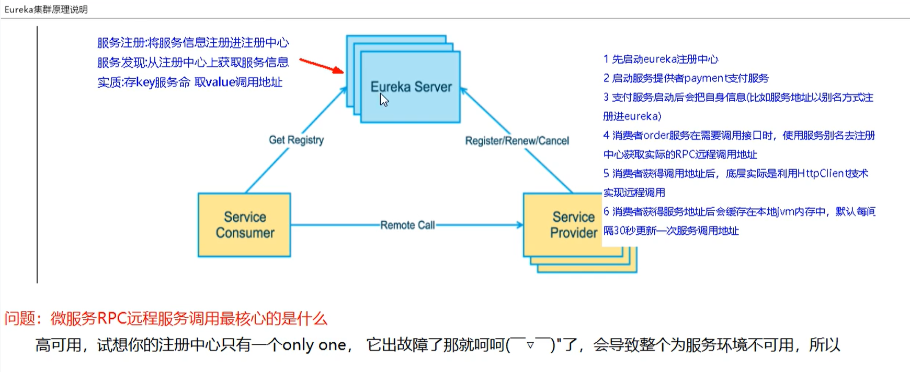
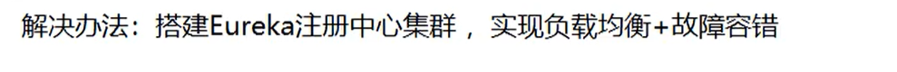

# Eureka

* [单机 Eureka 构建](#%E5%8D%95%E6%9C%BA-eureka-%E6%9E%84%E5%BB%BA)
  * [服务中心](#%E6%9C%8D%E5%8A%A1%E4%B8%AD%E5%BF%83)
  * [业务模块配置 Eureka 客户端](#%E4%B8%9A%E5%8A%A1%E6%A8%A1%E5%9D%97%E9%85%8D%E7%BD%AE-eureka-%E5%AE%A2%E6%88%B7%E7%AB%AF)
* [集群 Eureka 构建](#%E9%9B%86%E7%BE%A4-eureka-%E6%9E%84%E5%BB%BA)
  * [服务中心](#%E6%9C%8D%E5%8A%A1%E4%B8%AD%E5%BF%83-1)
  * [生产者模块配置集群](#%E7%94%9F%E4%BA%A7%E8%80%85%E6%A8%A1%E5%9D%97%E9%85%8D%E7%BD%AE%E9%9B%86%E7%BE%A4)
  * [消费者模块配置负载均衡](#%E6%B6%88%E8%B4%B9%E8%80%85%E6%A8%A1%E5%9D%97%E9%85%8D%E7%BD%AE%E8%B4%9F%E8%BD%BD%E5%9D%87%E8%A1%A1)
* [actuator微服务信息完善](#actuator%E5%BE%AE%E6%9C%8D%E5%8A%A1%E4%BF%A1%E6%81%AF%E5%AE%8C%E5%96%84)
* [服务发现 Discovery](#%E6%9C%8D%E5%8A%A1%E5%8F%91%E7%8E%B0-discovery)
* [Eureka自我保护](#eureka%E8%87%AA%E6%88%91%E4%BF%9D%E6%8A%A4)
    * [禁止自我保护](#%E7%A6%81%E6%AD%A2%E8%87%AA%E6%88%91%E4%BF%9D%E6%8A%A4)

> 服务注册与发现

eg：Eureka 类比物业公司，服务类比入驻企业

> 什么是服务治理?
>

服务治理（SOA governance），按照Anne Thomas Manes的定义是：企业为了确保事情顺利完成而实施的过程，包括最佳实践、架构原则、治理规程、规律以及其他决定性的因素。服务治理指的是用来==管理SOA==的采用和实现的过程。

> **服务治理针对的问题**

服务治理中一些典型的问题是：

1. 交付价值到利益相关者，这是投入与回报的问题
2. 对标准和规则的遵从（这是和审计相关的）
3. 变更管理：变更一个服务通常会引起不可预见的后果，因为服务的消费者对服务的提供者来说是不可知的。
4. 服务质量的保证：弹性添加新服务需要对这些服务给予额外的关注


链接：https://www.zhihu.com/question/56125281/answer/163547679

> 服务治理包括的==行为==

服务治理的一些关键活动包括：

1. 开发和升级服务计划
2. 管理服务的生命周期：确保升级服务不会影响目前的服务消费者
3. 制定方针来限制服务行为：制定所有服务都要遵从的规则，确保服务的一致性
4. 监控服务的性能：由于服务组合，服务停机和性能低下的后果是严重的。通过监控服务的性能和可用性，当问题出现的时候能马上采取应对措施。
5. 管理由谁来调用服务、怎样调用服务

> 什么是服务注册?

服务实例将自身服务信息注册到注册中心。 服务信息包括服务所在==主机IP==和提供服务的==Port==，以及暴露服务自身状态以及访问协议等信息

> 什么是服务发现？

服务发现：服务实例请求注册中心获取所依赖服务信息。 服务实例通过注册中心，获取到注册到其中的服务实例的信息，通过这些信息去请求它们提供的服务。


**小结**：一个物业公司(zookeeper、consul、Eureka...)提供平台（注册中心），企业(服务类) 向物业公司申请入驻(服务注册)，入驻需要提交信息(服务信息)，之后有人有需求物业公司就可以告诉他们去哪里可以解决需求(服务发现)。


> Eureka两组件?













## 单机 Eureka 构建

### 服务中心

1. 建module，eg：cloud-eureka-server7001

2. 改POM

   ```xml
   <dependency>
       <groupId>org.springframework.cloud</groupId>
       <artifactId>spring-cloud-starter-netflix-eureka-server</artifactId>
   </dependency>
   ```

   

3. 写 YML

   ```yaml
   server:
     port: 7001
   
   eureka:
     instance:
       hostname: eureka7001.com    # eureka服务端的实例名字
     client:
       register-with-eureka: false   # 表示不向注册中心注册自己
       fetch-registry: false   #表示自己就是注册中心，职责是维护服务实例，并不需要去检索服务
       # 设置与eureka server交互的地址查询服务和注册服务都需要依赖这个地址
       service-url:
        defaultZone: http://${eureka.instance.hostname}:${server.port}/eureka/
   
   
   ```

   

4. 主启动，添加 `@EnableEurekaServer`


### 业务模块配置 Eureka 客户端

1. 改 POM

   ```xml
   <dependency>
       <groupId>org.springframework.cloud</groupId>
       <artifactId>spring-cloud-starter-netflix-eureka-client</artifactId>
   </dependency>
   ```

2. 改 YML

   ```yaml
   eureka:
     client:
       # 表示是否将自己注册进EurekaServer默认为true。
       register-with-eureka: true
       # 是否从EurekaServer抓取已有的注册信息，默认为true。单节点无所谓，集群必须设置为true才能配合ribbon使用负载均衡
       fetchRegistry: true
       service-url:
         defaultZone: http://localhost:7001/eureka
         # 集群版
         # defaultZone: http://eureka7001.com:7001/eureka,http://eureka7002.com：7002/eureka
   ```

   

3. 主启动类，添加注解 `@EnableEurekaClient`

## 集群 Eureka 构建

### 服务中心

1. 建module，eg: cloud-eureka-server7002 

2. 修改 hosts 文件

   hosts 文件路径为 `C:\Windows\System32\drivers\etc\hosts`

   ```
   127.0.0.1       eureka7001.com
   127.0.0.1       eureka7002.com
   ```

3. 改 YML

```yaml
eureka:
  instance:
    hostname: eureka7001.com		# eureka服务端的实例名字
  client:
    register-with-eureka: false   # 表示不向注册中心注册自己
    fetch-registry: false   #表示自己就是注册中心，职责是维护服务实例，并不需要去检索服务
    service-url:
#    7001 配置 7002，7002 配置7001
     defaultZone: http://eureka7002.com:7002/eureka/
```

4. 业务模块改 YML

   ```yaml
   defaultZone: http://eureka7001.com:7001/eureka,http://eureka7002.com:7002/eureka
   
   ```

### 生产者模块配置集群

1. 复制生产者模块，cloud-provider-payment8002

2. 注意 YML 配置中，应用名称保持一致

   ```yaml
   spring:
     application:
       name: cloud-payment-service
   ```


### 消费者模块配置负载均衡

1. 修改配置类

   ```java
   @Bean
   @LoadBalanced
   public RestTemplate getRestTemplate()
   {
       return new RestTemplate();
   }
   ```

2. 修改 Controller

   ```java
   public static final String PAYMENT_URL = "http://CLOUD-PAYMENT-SERVICE";
   ```

3. 测试负载均衡

   先启动服务-再启动请求

## actuator微服务信息完善

```xml
<dependency>
    <groupId>org.springframework.boot</groupId>
    <artifactId>spring-boot-starter-actuator</artifactId>
</dependency>
```

添加 yaml 配置

```yaml
eureka:
  instance:
  	# 服务实例 ID
    instance-id: payment8001
    # 访问路径可以显示IP地址
    prefer-ip-address: true
```

## 服务发现 Discovery

对于注册进eureka里面的微服务，可以通过服务发现来获得该服务的信息。

1. 主启动类，添加注解 `@EnableDiscoveryClient`

2. 业务代码

   ```java
   @Autowired
   private DiscoveryClient discoveryClient;
   
   @GetMapping("/discovery")
   public Object discovery() {
       List<String> services = discoveryClient.getServices();
       for (String service : services) {
           log.info("service *** {}" + service);
   
           List<ServiceInstance> instances = discoveryClient.getInstances(service);
           for (ServiceInstance instance : instances) {
               log.error("instance *** {}", instance);
           }
       }
   
   
       return discoveryClient;
   }
   ```

   

## Eureka自我保护

> 某时刻某一个微服务不可用了，Eureka不会立刻清理，依旧会对该微服务的信息进行保存
>
> 属于CAP里面的AP分支

#### 禁止自我保护

当服务没有提供心跳信息，会立刻从注册中心中删除

1. Eureka 服务中心配置

   ```yaml
   eureka:  
     server:
       enable-self-preservation: false   # 关闭自我保护机制，保证不可用服务被及时踢除
       eviction-interval-timer-in-ms: 2000
   ```

2. Eureka 客户端配置

   ```yaml
   eureka:
     instance:
       # Eureka客户端向服务端发送心跳的时间间隔，单位为秒(默认是30秒)
       lease-renewal-interval-in-seconds: 1  
       #  Eureka服务端在收到最后一次心跳后等待时间上限，单位为秒(默认是90秒)，超时将剔除服务
       lease-expiration-duration-in-seconds: 2   
   ```

   


