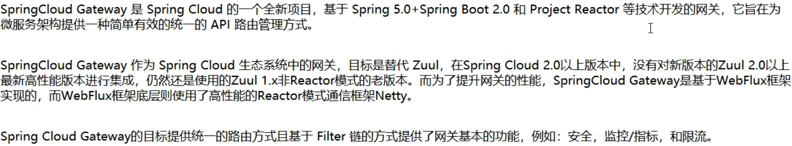

# GateWay

## 简介

> 新一代网关

Spring Cloud Gateway 使用的 Webflux 中的 reactor-netty **响应式**编程组件，底层使用了 Netty 通讯框架

官网：

- [Zuul](https://github.com/Netflix/zuul/wiki)
- [Gateway](https://cloud.spring.io/spring-cloud-static/spring-cloud-gateway/2.2.1.RELEASE/reference/html/)




### 功能

- 反向代理
- 鉴权
- 流量控制
- 熔断
- 日志监控
- ...

微服务架构中网关的位置


### 对比 Zuul 和 Gateway

##### Zuul

- Zuul 1进入维护阶段，Zuul 2 一直跳票
- 在 Spring Cloud F 版，推荐使用 Zuul
- 基于 Servlet 2.5 使用 **阻塞 IO** 架构

##### Gateway

- Servlet 3.1 之后有了异步非阻塞的支持
- Gateway 基于**异步非阻塞**模型
- Spring Cloud Gateway 具有如下特性
  - 基于 Spring Framework 5，Project Reactor 和 Spring Boot 2.0 构建
  - **动态路由**：能够匹配任何请求属性
  - 可以对路由指定 **Predicate（断言）和 Filter（过滤器）**
  - 集成 Hystrix 的断路器功能
  - 集成 Spring Cloud 服务发现功能
  - 请求限流功能
  - 支持路径重写

### 三大核心概念


- Route(路由)

  路由是构建网关的基本模块，它由ID，目标URI，一系列的断言和过滤器组成，如果断言为true则匹配该路由

- Predicate（断言）

  参考的是java8的 `java.util.function.Predicate` 开发人员可以匹配HTTP请求中的所有内容（例如请求头或请求参数），**如果请求与断言相匹配则进行路由**

- Filter(过滤)

  指的是Spring框架中GatewayFilter的实例，使用过滤器，可以在请求被路由前或者之后对请求进行修改。

### 核心逻辑

**路由转发+执行过滤器链**


## 案例

### 配置网关(加一层保护)

#### 配置方式

1. Module，eg：cloud-gateway-gateway9527

2. POM

   ```xml
   <dependency>
       <groupId>org.springframework.cloud</groupId>
       <artifactId>spring-cloud-starter-gateway</artifactId>
   </dependency>
   ```

3. **写yml**

```yaml
server:
  port: 9527
spring:
  application:
    name: cloud-gateway
  cloud:
    gateway:
      discovery:
        locator:
          enabled: true  #开启从注册中心动态创建路由的功能，利用微服务名进行路由
      routes:
        - id: payment_routh #路由的ID，没有固定规则但要求唯一，建议配合服务名
          uri: http://localhost:8001   #匹配后提供服务的路由地址
          predicates:
            - Path=/payment/get/**   #断言,路径相匹配的进行路由

        - id: payment_routh2
          uri: http://localhost:8001
          predicates:
            - Path=/payment/lb/**   #断言,路径相匹配的进行路由


eureka:
  instance:
    hostname: cloud-gateway-service
  client:
    service-url:
      register-with-eureka: true
      fetch-registry: true
      defaultZone: http://eureka7001.com:7001/eureka

```

 主启动类 

		@SpringBootApplication
		@EnableEurekaClient

直接访问原服务路径 `localhost:8001/payment/get/1` 和 `localhost:8001/payment/lb`，可以成功

通过网关访问服务 `localhost:9527/payment/get/1` 和 `localhost:9527/payment/lb`，可以成功

#### 编码方式

配置类

```java
@Configuration
public class GateWayConfig {
    @Bean
    public RouteLocator customRouteLocator(RouteLocatorBuilder routeLocatorBuilder) {
        RouteLocatorBuilder.Builder routes = routeLocatorBuilder.routes();
        routes.route("path_rote_atguigu", r -> r.path("/guoji").uri("http://news.baidu.com/guoji")).build();
        return routes.build();
    }
}
```

---

### 配置动态路由

默认情况下Gateway会根据注册中心的服务列表，以注册中心上微服务名为路径创建动态路由进行转发，从而实现动态路由的功能(通过微服务名字实现动态路由)，**重点是将写死的 uri 改为微服务名字**

```yaml
server:
  port: 9527
spring:
  application:
    name: cloud-gateway
  cloud:
    gateway:
      discovery:
        locator:
          enabled: true  #开启从注册中心动态创建路由的功能，利用微服务名进行路由
      routes:
        - id: payment_routh #路由的ID，没有固定规则但要求唯一，建议配合服务名
#          uri: http://localhost:8001   #匹配后提供服务的路由地址
          uri: lb://cloud-payment-service
          predicates:
            - Path=/payment/get/**   #断言,路径相匹配的进行路由

        - id: payment_routh2
#          uri: http://localhost:8001
          uri: lb://cloud-payment-service
          predicates:
            - Path=/payment/lb/**   #断言,路径相匹配的进行路由


eureka:
  instance:
    hostname: cloud-gateway-service
  client:
    service-url:
      register-with-eureka: true
      fetch-registry: true
      defaultZone: http://eureka7001.com:7001/eureka


```

### Predicate的使用

[官网文档](https://cloud.spring.io/spring-cloud-static/spring-cloud-gateway/2.2.1.RELEASE/reference/html/#gateway-request-predicates-factories)

配置的都是 `org.springframework.cloud.gateway.handler.predicate.RoutePredicateFactory` 接口的实现类


。。。。

---


### Filter的使用

#### 生命周期

- pre

  在业务逻辑之前

- post

  在业务逻辑之后


#### 种类

- GatewayFilter

  单一，[官网文档](https://cloud.spring.io/spring-cloud-static/spring-cloud-gateway/2.2.1.RELEASE/reference/html/#gatewayfilter-factories)

- GlobalFilter

  全局，[官网文档](https://cloud.spring.io/spring-cloud-static/spring-cloud-gateway/2.2.1.RELEASE/reference/html/#global-filters)

#### 自定义全局GlobalFilter

```java
/**
 * 要求请求中带参数 uname，否则返回 406, "Not Acceptable"
 */
@Component
@Slf4j
public class MyLogGateWayFilter implements GlobalFilter, Ordered {

    @Override
    public Mono<Void> filter(ServerWebExchange exchange, GatewayFilterChain chain) {
        log.info("***********come in MyLogGateWayFilter:  " + new Date());

        String uname = exchange.getRequest().getQueryParams().getFirst("uname");

        if (uname == null) {
            log.info("*******用户名为null，非法用户，o(╥﹏╥)o");
            exchange.getResponse().setStatusCode(HttpStatus.NOT_ACCEPTABLE);
            return exchange.getResponse().setComplete();
        }

        return chain.filter(exchange);
    }

    @Override
    public int getOrder() {
        return 0;
    }
}
```


