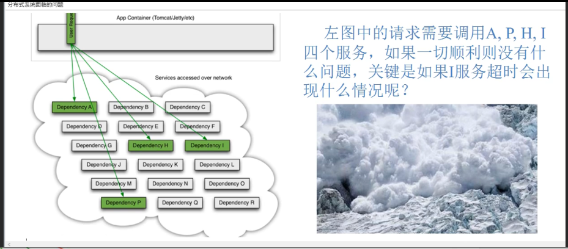
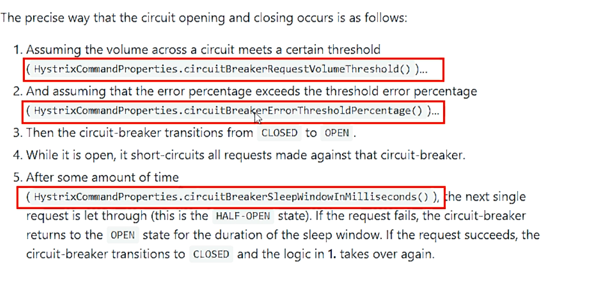
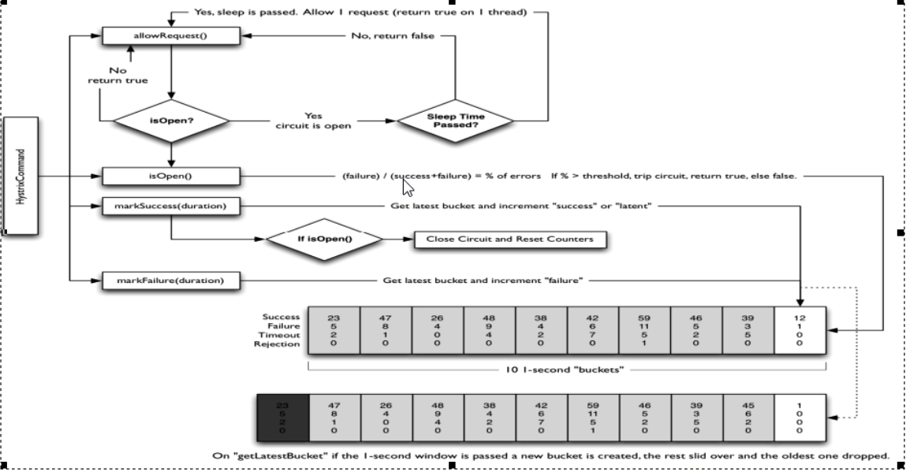
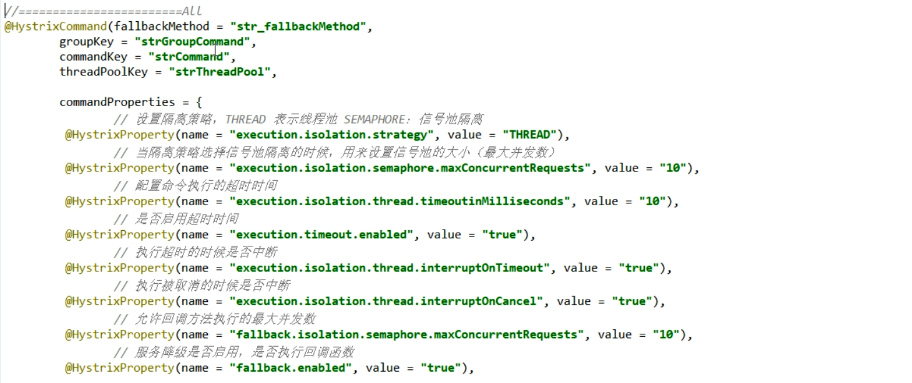
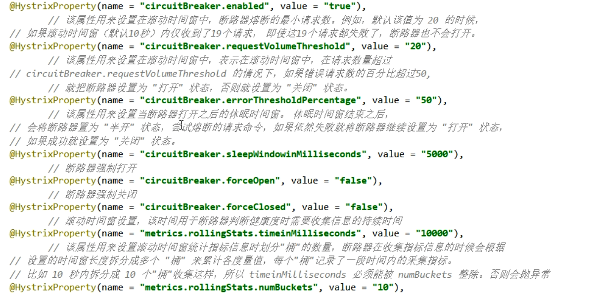
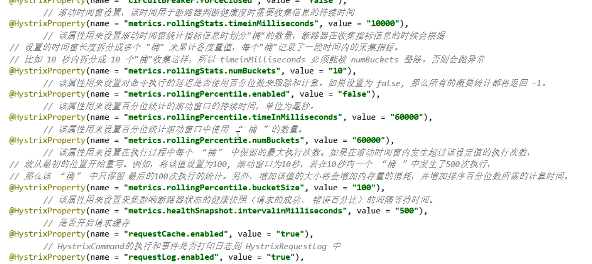

# Hystrix

## 简介

> 断路器

为什么需要Hystrix？

在大中型分布式系统中，通常系统很多依赖(HTTP,hession,Netty,Dubbo等)，如下图:



问题：

服务雪崩：扇出：多个微服务之间相互调用，A调B、C，B调C、其它。如果扇出过程中某个微服务调用响应时间过长或者不可用，导致对某服务的调用占据过多的系统资源，引发系统崩溃，导致雪崩效应。

Hystrix：

Hystrix 是一个用于处理分布式系统的**延迟**和**容错**的开源库

能够保证在一个依赖出问题的情况下，不会导致整体服务失败，避免级联故障，以提高分布式系统的弹性

向调用方返回一个符合预期的、可处理的备选响应（FallBack），而不是长时间的等待或者抛出调用方无法处理的异常

Hystrix官宣，**停更进维**

Github：https://github.com/Netflix/Hystrix


### 主要功能

- 服务降级
- 服务熔断
- 接近实时的监控

## 概念

#### 服务降级（fallback）

服务器忙，请稍候再试，不让客户端等待并立刻返回一个友好提示，fallback

一般用于客户端，即服务消费者

哪些情况会触发降级

- 程序运行异常 -- 解决：兜底

- 超时  -- 解决：不再等待

- 服务熔断触发服务降级

- 线程池/信号量打满也会导致服务降级

  

#### 服务熔断（break）

类比保险丝，达到最大服务访问后，直接拒绝访问，拉闸限电，然后调用服务降级的方法并返回友好提示

服务的降级->进而熔断->**恢复调用链路**

当失败的调用到一定阈值，默认是5秒内20次调用失败，就会启动熔断机制


#### 服务限流（flowlimit）

秒杀高并发等操作，严禁一窝蜂的过来拥挤，大家排队，一秒钟N个，有序进行

#### 接近实时的监控


#### 降级容错解决的要求

- 超时导致服务器变慢（转圈）
  超时不再等待

- 出错（宕机或程序运行出错）
  出错要有兜底

  

## Hystrix案例

### 服务降级

#### 服务提供者

建 modules，eg：cloud-provider-hystrix-payment8001

改 POM

```xml
<dependency>
    <groupId>org.springframework.cloud</groupId>
    <artifactId>spring-cloud-starter-netflix-hystrix</artifactId>
</dependency>
```

改 YML

```yaml
server:
  port: 8001


eureka:
  client:
    register-with-eureka: true    #表识不向注册中心注册自己
    fetch-registry: true   #表示自己就是注册中心，职责是维护服务实例，并不需要去检索服务
    service-url:
      # defaultZone: http://eureka7002.com:7002/eureka/    #设置与eureka server交互的地址查询服务和注册服务都需要依赖这个地址
      defaultZone: http://eureka7001.com:7001/eureka/
#  server:
#    enable-self-preservation: false
spring:
  application:
    name: cloud-provider-hystrix-payment
#    eviction-interval-timer-in-ms: 2000
```

主启动类，添加注解 `@EnableCircuitBreaker`

**服务降级**，改业务服务类

```java
// 超时时间设置为 3s
@HystrixCommand(fallbackMethod = "paymentInfo_TimeOutHandler", commandProperties = {@HystrixProperty(name = "execution.isolation.thread.timeoutInMilliseconds", value = "3000")})
public String paymentInfo_TimeOut(Integer id) {
    // 程序异常
    int age = 10 / 0;

    // 超时
    // try {
    //     TimeUnit.MILLISECONDS.sleep(5000);
    // } catch (InterruptedException e) {
    //     e.printStackTrace();
    // }

    return "线程池:  " + Thread.currentThread().getName() + " id:  " + id + "\t" + "O(∩_∩)O哈哈~" + "  耗时(秒): ";
}

public String paymentInfo_TimeOutHandler(Integer id) {
    return "线程池:  " + Thread.currentThread().getName() + "  8001系统繁忙或者运行报错，请稍后再试,id:  " + id + "\t" + "o(╥﹏╥)o";
}
```

**服务熔断**

`@HystrixCommand` 注解中可配的属性位于 `com.netflix.hystrix.HystrixCommandProperties` 中

业务类启用

```java
@HystrixCommand(fallbackMethod = "paymentCircuitBreaker_fallback", commandProperties = {@HystrixProperty(name = "circuitBreaker.enabled", value = "true"),// 是否开启断路器
        @HystrixProperty(name = "circuitBreaker.requestVolumeThreshold", value = "10"),// 请求次数
        @HystrixProperty(name = "circuitBreaker.sleepWindowInMilliseconds", value = "10000"), // 时间窗口期
        @HystrixProperty(name = "circuitBreaker.errorThresholdPercentage", value = "60"),// 失败率达到多少后跳闸
})
public String paymentCircuitBreaker(@PathVariable("id") Integer id) {
    if (id < 0) {
        throw new RuntimeException("******id 不能负数");
    }
    String serialNumber = IdUtil.simpleUUID();

    return Thread.currentThread().getName() + "\t" + "调用成功，流水号: " + serialNumber;
}

public String paymentCircuitBreaker_fallback(@PathVariable("id") Integer id) {
    return "id 不能负数，请稍后再试，/(ㄒoㄒ)/~~   id: " + id;
}
```


#### 服务消费者

1. 建 Module，cloud-consumer-feign-hystrix-order80
2. 改 POM，同上
3. 改 YML

```yaml
feign:
  hystrix:
    enabled: true #如果处理自身的容错就开启。开启方式与生产端不一样。
```

4. 主启动类，添加注解 `@EnableHystrix`

5. **服务降级**，Controller 调用 Feign 接口

   ```java
   // 超时时间 2s
   @GetMapping("/consumer/payment/hystrix/timeout/{id}")
   @HystrixCommand(fallbackMethod = "paymentTimeOutFallbackMethod", commandProperties = {@HystrixProperty(name = "execution.isolation.thread.timeoutInMilliseconds", value = "2000")})
   public String paymentInfo_TimeOut(@PathVariable("id") Integer id) {
       // 程序异常
       // int age = 10 / 0;
   
       String result = paymentHystrixService.paymentInfo_TimeOut(id);
       return result;
   }
   
   public String paymentTimeOutFallbackMethod(@PathVariable("id") Integer id) {
       return "我是消费者80,对方支付系统繁忙请10秒钟后再试或者自己运行出错请检查自己,o(╥﹏╥)o  " + id;
   }
   ```

6. **服务降级**，Controller 全局服务降级

```java
@RestController
@Slf4j
@DefaultProperties(defaultFallback = "payment_Global_FallbackMethod")
public class OrderHystirxController {
	@Resource
    private PaymentHystrixService paymentHystrixService;
    
    @GetMapping("/consumer/payment/hystrix/timeout/{id}")
    @HystrixCommand
    public String paymentInfo_TimeOut(@PathVariable("id") Integer id) {
        // 程序异常
        // int age = 10 / 0;

        String result = paymentHystrixService.paymentInfo_TimeOut(id);
        return result;
    }
    
    public String payment_Global_FallbackMethod() {
        return "Global异常处理信息，请稍后再试，/m(ㄒoㄒ)/~~";
    }
}
```

#### 统一处理

每个业务方法提供一个对应的兜底方法，导致代码膨胀

解决：统一处理 + 自定义 分开

步骤

 服务降级**，通配服务降级，针对 Feign 接口的调用

1. 实现 Feign 接口

```java
@Component
public class PaymentFallbackService implements PaymentHystrixService {
    @Override
    public String paymentInfo_OK(Integer id) {
        return "-----PaymentFallbackService fall back-paymentInfo_OK ,o(╥﹏╥)o";
    }

    @Override
    public String paymentInfo_TimeOut(Integer id) {
        return "-----PaymentFallbackService fall back-paymentInfo_TimeOut ,o(╥﹏╥)o";
    }
}
```

2. Feign 接口添加注解属性 `org.springframework.cloud.openfeign.FeignClient#fallback`

```java
@Component
@FeignClient(value = "CLOUD-PROVIDER-HYSTRIX-PAYMENT" ,fallback = PaymentFallbackService.class)
public interface PaymentHystrixService {
    @GetMapping("/payment/hystrix/ok/{id}")
    public String paymentInfo_OK(@PathVariable("id") Integer id);

    @GetMapping("/payment/hystrix/timeout/{id}")
    public String paymentInfo_TimeOut(@PathVariable("id") Integer id);
}
```


### 服务熔断

#### 原理

- 熔断打开
  请求不再进行调用当前服务，内部设置时钟一般为MTTR(平均故障处理时间)，当打开时长达到所设时钟则进入熔断状态
- 熔断关闭
  熔断关闭不会对服务进行熔断
- 熔断半开
  部分请求根据规则调用当前服务，如果请求成功且符合规则则认为当前服务恢复正常，关闭熔断

> 类似于保险丝的存在

大神论文：https://martinfowler.com/bliki/CircuitBreaker.html

#### 断路器开启或者关闭的条件

1. 当满足一定阀值的时候（默认10秒内超过20个请求次数）
2. 当失败率达到一定的时候（默认10秒内超过50%请求失败）
3. 到达以上阀值，断路器将会开启
4. 当开启的时候，所有请求都不会进行转发
5. 一段时间之后（默认是5秒），这个时候断路器是半开状态，会让其中一个请求进行转发。如果成功，断路器会关闭，若失败，继续开启。重复4和5

#### Hystrix工作流程

[GitHub 地址](https://github.com/Netflix/Hystrix/wiki/How-it-Works)


#### 实操

```java
//服务熔断
@HystrixCommand(fallbackMethod = "paymentCircuitBreaker_fallback",commandProperties = {
        @HystrixProperty(name = "circuitBreaker.enabled",value = "true"),  //是否开启断路器
        @HystrixProperty(name = "circuitBreaker.requestVolumeThreshold",value = "10"),   //请求次数
        @HystrixProperty(name = "circuitBreaker.sleepWindowInMilliseconds",value = "10000"),  //时间范围
        @HystrixProperty(name = "circuitBreaker.errorThresholdPercentage",value = "60"), //失败率达到多少后跳闸
})
public String paymentCircuitBreaker(@PathVariable("id") Integer id){
    if (id < 0){
        throw new RuntimeException("*****id 不能负数");
    }
    String serialNumber = IdUtil.simpleUUID();

    return Thread.currentThread().getName()+"\t"+"调用成功,流水号："+serialNumber;
}
public String paymentCircuitBreaker_fallback(@PathVariable("id") Integer id){
    return "id 不能负数，请稍候再试,(┬＿┬)/~~     id: " +id;
}
 
```




多次错误,然后慢慢正确，发现刚开始不满足条件，就算是正确的访问地址也不能进行访问，需要慢慢的恢复链路


官网流程图




ALL 配置，可以在注解中可配的属性位于 `com.netflix.hystrix.HystrixCommandProperties` 中找到









### 服务限流

后面alibaba的sentinel补充


### 服务监控

> HystrixDashboard

监控的微服务需要依赖 `Spring-boot-starter-actuator`，一般直接和web-starer 一起粘贴进来

#### 创建步骤

1. Module，eg：cloud-consumer-hystrix-dashboard9001
2. POM

```xml
<dependency>
    <groupId>org.springframework.cloud</groupId>
    <artifactId>spring-cloud-starter-netflix-hystrix-dashboard</artifactId>
</dependency>
```

3. YML--写个端口
4. 主启动类，添加注解 `@EnableHystrixDashboard`
5. 启动程序，访问 `http://localhost:9001/hystrix`

#### 断路器演示

1. 改造被监控的微服务(新版本的坑)

   ```java
      @Bean
       public ServletRegistrationBean getServlet() {
           HystrixMetricsStreamServlet streamServlet = new HystrixMetricsStreamServlet();
           ServletRegistrationBean registrationBean = new ServletRegistrationBean(streamServlet);
           registrationBean.setLoadOnStartup(1);
           registrationBean.addUrlMappings("/hystrix.stream");
           registrationBean.setName("HystrixMetricsStreamServlet");
           return registrationBean;
       }
   ```

2. 访问 `http://localhost:9001/hystrix`

3. 填写 `http://localhost:8001/hystrix.stream`


