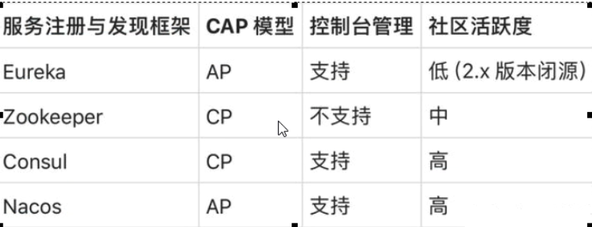
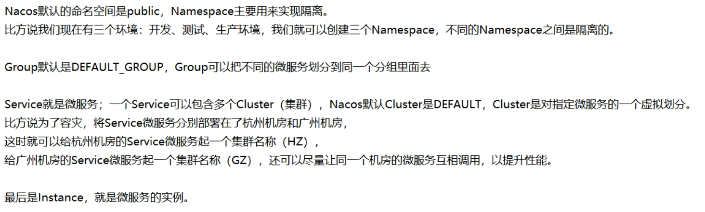
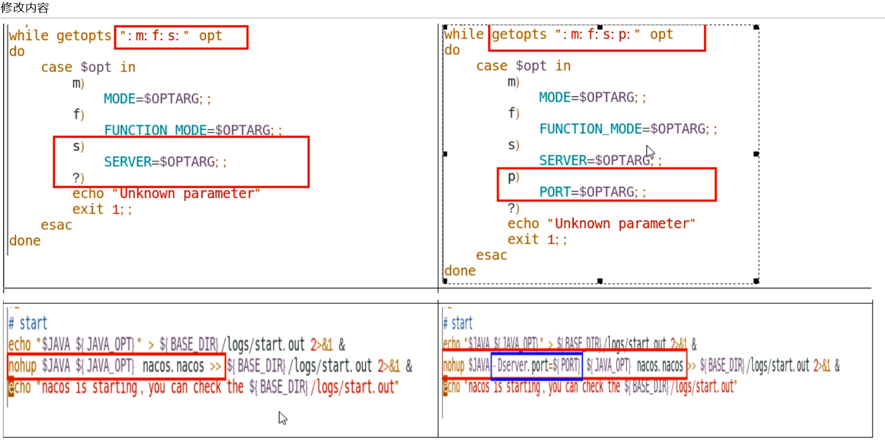
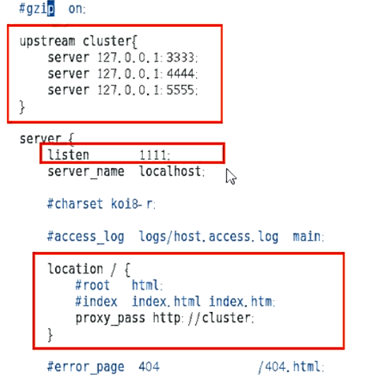
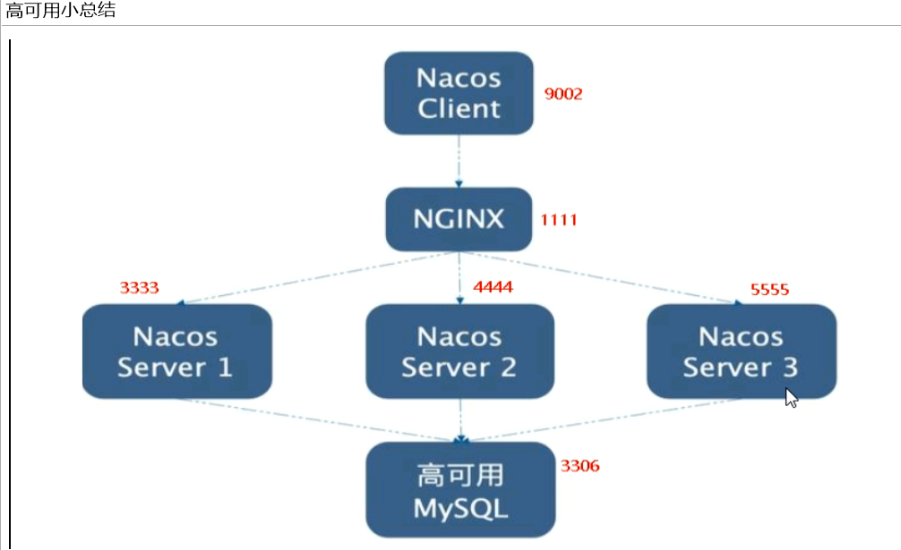

# Nacos

## 简介

> 注册中心 + 配置中心

Nacos = Eureka+Config+Bus


#### 能干嘛

替代Eureka做服务注册中心

替代Config做服务配置中心


#### 官网：

[GitHub](https://github.com/alibaba/Nacos)

[Nacos 官网文档](https://nacos.io/zh-cn/index.html)

[Spring 官方文档](https://spring-cloud-alibaba-group.github.io/github-pages/greenwich/spring-cloud-alibaba.html#_spring_cloud_alibaba_nacos_discovery)


#### 安装并运行Nacos

- 本地Java8+Maven环境已经OK
- 先从官网下载Nacos：https://github.com/alibaba/nacos/releases
- 解压安装包，直接运行bin目录下的 startup.cmd
- 命令运行成功后直接访问 http://localhost:8848/nacos         
- 默认密码都是 nacos


## 注册中心

#### 基于Nacos的服务提供者

- Module，cloudalibaba-provider-payment9001

- POM

  ```xml
  <dependency>
      <groupId>com.alibaba.cloud</groupId>
      <artifactId>spring-cloud-starter-alibaba-nacos-discovery</artifactId>
  </dependency>
  ```

- yml

  ```yaml
  server:
    port: 9001
  
  spring:
    application:
      name: nacos-payment-provider
    cloud:
      nacos:
        discovery:
          server-addr: localhost:8848 #配置Nacos地址
  
  management:
    endpoints:
      web:
        exposure:
          include: '*'
  
  ```

- 主启动类，添加注解 `@EnableDiscoveryClient`

- 业务类，例如：

  ```java
  @RestController
  public class PaymentController {
      @Value("${server.port}")
      private String serverPort;
  
      @GetMapping(value = "/payment/nacos/{id}")
      public String getPayment(@PathVariable("id") Integer id) {
          return "nacos registry, serverPort: " + serverPort + "\t id" + id;
      }
  }
  ```

- 测试

  1. 访问服务接口 http://localhost:9001/payment/nacos/1
  2. 查看 Nacos 控制台，服务列表

**集群**

为了演示负载均衡，复制 cloudalibaba-provider-payment9001 为 cloudalibaba-provider-payment9002

**IDEA 拷贝配置作为集群**

Services 窗口里，右键微服务，Copy Configuration，配置 VM Options，`-Dserver.port=9011`，启动 Copy 的微服务，测试 Copy 的微服务


#### 基于Nacos的服务消费者

- Module，cloudalibaba-consumer-nacos-order83

- POM，同上

- YML

  ```yaml
  spring:
    application:
      name: nacos-order-consumer
    cloud:
      nacos:
        discovery:
          server-addr: localhost:8848
  
  
  #消费者将要去访问的微服务名称(注册成功进 nacos 的微服务提供者)
  service-url:
    nacos-user-service: http://nacos-payment-provider
  
  server:
    port: 83
  ```

- 主启动类，添加 `@EnableDiscoveryClient`

- 业务类

  ```java
  @RestController
  public class OrderNacosController {
      @Resource
      private RestTemplate restTemplate;
  
      @Value("${service-url.nacos-user-service}")
      private String serverURL;
  
      @GetMapping(value = "/consumer/payment/nacos/{id}")
      public String paymentInfo(@PathVariable("id") Long id) {
          return restTemplate.getForObject(serverURL + "/payment/nacos/" + id, String.class);
      }
  
  }
  ```

- 测试

  1. 查看 Nacos 控制台，服务列表

  2. 访问服务接口 http://localhost:83/consumer/payment/nacos/13

     83访问9001/9002，轮询负载OK


#### 服务注册中心对比



Nacos支持AP和CP模式的切换

**C是所有节点在同一时间看到的数据是一致的；而A的定义是所有的请求都会收到响应。**

何时选择使用何种模式？

一般来说，如果不需要存储服务级別的信息且服务实例是通过 nacos- client 注册，并能够保持心跳上报，那么就可以选择AP模式。当前主流的服务如 Spring cloud 和 Dubbo 服务，都适用于AP模式，AP模式为了服务的可能性而减弱了一致性，因此AP模式下只支持注册临时实例。

如果需要在服务级别编辑或者存储配置信息，那么CP是必须，K8S服务和DNS服务则适用于CP模式。CP模式下则支持注册持久化实例，此时则是以 Raft 协议为集群运行模式，该模式下注册实例之前必须先注册服务，如果服务不存在，则会返回错误


## 服务配置中心

#### 基础配置

- Module，cloudalibaba-config-nacos-client3377

- POM

  ```xml
  <!--nacos-config-->
  <dependency>
      <groupId>com.alibaba.cloud</groupId>
      <artifactId>spring-cloud-starter-alibaba-nacos-config</artifactId>
  </dependency>
  <!--nacos-discovery-->
  <dependency>
      <groupId>com.alibaba.cloud</groupId>
      <artifactId>spring-cloud-starter-alibaba-nacos-discovery</artifactId>
  </dependency>
  ```

- YML

  1. bootstrap.yml

     ```yaml
     spring:
       application:
         name: nacos-config-client
       cloud:
         nacos:
           discovery:
             server-addr: localhost:8848 #Nacos服务注册中心地址
           config:
             server-addr: localhost:8848 #Nacos作为配置中心地址
             file-extension: yaml #指定yaml格式的配置
     ```

  2. application.yml

     ```yaml
     spring:
       profiles:
         active: dev # 表示开发环境
     ```

- 主启动类，添加注解 `@EnableDiscoveryClient`

- 业务类，添加注解 `@RefreshScope`，支持自动刷新

  ```java
  @RestController
  @RefreshScope //支持Nacos的动态刷新功能。
  public class ConfigClientController {
      @Value("${config.info}")
      private String configInfo;
  
      @GetMapping("/config/info")
      public String getConfigInfo() {
          return configInfo;
      }
  }
  ```

- 在 Nacos 中添加配置，nacos-config-client-dev.yaml，例如内容为

  ```yaml
  config:
      info: nacos config center,version = 2 from nacos config center, nacos-config-client-dev.yaml, version=3
  ```

- 测试

  1. 访问 http://localhost:3377/config/info
  2. 修改配置后，重新调用，测试自动刷新


#### Nacos作为配置中心-分类配置

Nacos 数据模型 Key 由三元组唯一确定, Namespace默认是空串，公共命名空间（public），分组默认是 DEFAULT_GROUP。

> Namespace + Group + Data ID

**DataID 方案**

指定 `spring.profile.active` 和配置文件的 DataID 来使不同环境下读取不同的配置

```yaml
## Nacos 配置文件名称规则
${spring.application.name}-${spring.profile.active}.${spring.cloud.nacos.config.file-extension}
```

**Group 方案**

`bootstrap.yml` 中指定 `spring.cloud.nacos.config.group`，对应 Nacos 中的 `Group`。

**Namespace 方案**

`bootstrap.yml` 中指定 `spring.cloud.nacos.config.namespace`，对应 Nacos 中的 `Namespace` 的 ID。

总结：可以用来做环境隔离




## Nacos集群和持久化配置（重要）

[集群部署说明](https://nacos.io/zh-cn/docs/cluster-mode-quick-start.html)

[部署手册](https://nacos.io/zh-cn/docs/deployment.html)

#### Nacos持久化配置解释

Nacos 默认自带的是嵌入式数据库 derby

支持 Mysql

##### derby到mysql切换配置步骤

1. 安装数据库，版本要求：`5.6.5+`

2. 初始化mysql数据库，数据库初始化文件：找到并执行`nacos-mysql.sql`

   ```shell
   source nacos-mysql.sql
   ```

   

3. 修改 `conf/application.properties` 文件，增加支持 mysql 数据源配置（目前只支持 mysql），添加 mysql 数据源的 url、用户名和密码，注意点：mysql5.6+ 和 mysql 8+ 的配置是不同的，还需要开启数据库的远程访问权限

   ```properties
   spring.datasource.platform=mysql
    
   db.num=1
   db.url.0=jdbc:mysql://localhost:3306/nacos_config?characterEncoding=utf8&connectTimeout=1000&socketTimeout=3000&autoReconnect=true
   db.user=root
   db.password=Aragaki..00
   ```


预计需要 1个nginx  3个nacos 1个mysql(高可用)才能组成集群

https://github.com/alibaba/nacos/releases/tag/1.1.4 

1.1.4 只支持`mysql 5`版本，如果需要使用高版本mysql 可以修改源码，或者提高nacos版本


步骤

执行naocs 数据源切换，步骤参考上面。

写集群配置，梳理出3台nacos机器的不同服务端口号

​    修改文件前先做个备份

​	复制出cluster.conf

```conf
ip:port
ip:port
ip:port
```

  这个IP不能写127.0.0.1,必须是Linux命令**hostname -I** 能够识别的IP，注意如果是参数 -i 可能只显示127..1

修改 `bin` 下 startup.sh



执行 ./startup.sh -p 3333		注意最好启动完测试一下，避免JVM内存不足导致可能有机器无法启动


修改 Nginx 配置



按照指定配置文件启动 ./nginx -c  /配置文件


测试集群

https://写你自己虚拟机的ip:1111/nacos/#/login

​	新建一个配置测试

​	linux服务器的mysql插入一条记录，可以查看一下是否成功


微服务cloudalibaba-provider-payment9002启动注册进nacos集群

server-addr:  写你自己的虚拟机ip:80





遇到的坑：

​	mysql 版本问题，1.1.4 不支持 mysql 8

   解决提高 nacos版本 或 降低 mysql版本

   mysql 卸载不干净...


