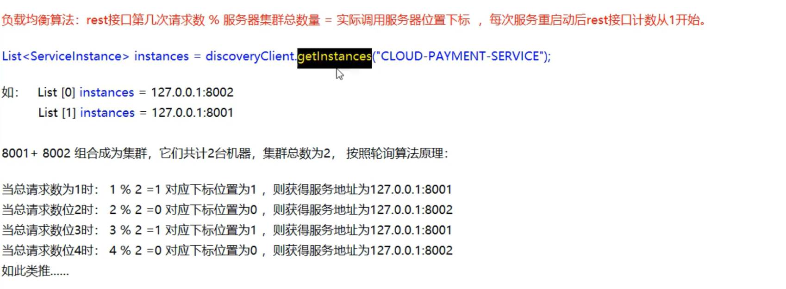

# Ribbon

> 负载均衡服务调用

**客户端** **负载均衡** 的工具，主要功能是提供客户端的软件负载均衡算法和服务调用

Ribbon目前也进入维护模式，未来可以使用 Spring Cloud LoadBalancer 替代

官网：https://github.com/Netflix/ribbon/wiki/Getting-Started


## 功能

### LB（负载均衡）

集中式LB

服务消费方和提供方之间使用的独立 LB设施(可以是硬件，如F5，也可以是软件，如Nginx)，由该设施负责把==访问请求通过某种策略发送到提供方==。

例如 Nginx，Nginx 是服务器负载均衡，客户端所有请求都会交给 Nginx ，然后由 Nginx 实现转发请求。即负载均衡是由服务端实现的。

进程内LB

将 LB 逻辑集成到消费方，消费方从服务注册中心获知有哪些地址可用，然后从这些地址中选择一个合适的服务器。

Ribbon 本地负载均衡，在调用微服务接口时，会在注册中心上获取注册信息服务列表之后缓存到 JVM 本地，从而在本地实现 RPC 远程服务调用技术。

==负载均衡+RestTemplate调用==


### Ribbon负载均衡演示

总结：Ribbon其实就是一个软负载均衡的客户端组件，他可以和其他所需请求的客户端结合使用，和eureka结合只是其中的一个实例。


#### POM

`spring-cloud-starter-netflix-eureka-client` 依赖中自带了 `spring-cloud-starter-netflix-ribbon`，所以无需手动引入

```xml
<dependency>
    <groupId>org.springframework.cloud</groupId>
    <artifactId>spring-cloud-starter-netflix-ribbon</artifactId>
</dependency>
```

#### RestTemplate的使用

getForObject：返回对象

```java
CommonResult commonResult = restTemplate.getForObject(PAYMENT_URL + "/payment/get/" + id, CommonResult.class);
```

getForEntity：返回 ResponseEntity，包含更多信息

```java
ResponseEntity<CommonResult> entity = restTemplate.getForEntity(PAYMENT_URL+"/payment/get/"+id,CommonResult.class);
```


### Ribbon核心组件IRule

>  IRule:根据特定算法从服务列表中选取一个要访问的服务

- com.netflix.loadbalancer.RoundRobinRule
  	轮询
- com.netflix.loadbalancer.RandomRule
  	随机
- com.netflix.loadbalancer.RetryRule
  	先按照RoundRobinRule的策略获取服务，如果获取服务失败则在指定时间内会进行重试
- WeightedResponseTimeRule 
  	对RoundRobinRule的扩展，响应速度越快的实例选择权重越大，越容易被选择
- BestAvailableRule 
  	会先过滤掉由于多次访问故障而处于断路器跳闸状态的服务，然后选择一个并发量最小的服务
- AvailabilityFilteringRule 
  	先过滤掉故障实例，再选择并发较小的实例
- ZoneAvoidanceRule
  	默认规则，复合判断server所在区域的性能和server的可用性选择服务器

### 替换负载均衡算法

**注意**：算法的配置类不能位于包扫描范围内，需要独立出来。例如，启动类在包 `com.atguigu.springcloud` 下，算法的配置类就不能位于此包及其子包下，可以位于包 `com.atguigu.myrule` 下。

替换步骤：

​	新建配置类，`com.atguigu.myrule.MySelfRule`

```java
@Configuration
public class MySelfRule {
    @Bean
    public IRule myRule() {
        return new RandomRule();	//定义为随机
    }
}
```

​	主配置类

```java
@RibbonClient(name = "CLOUD-PAYMENT-SERVICE",configuration= MySelfRule.class)
```

## 手写轮询算法

#### 原理



提供方改造Controller

```java
@GetMapping(value = "/payment/lb")public String getPaymentLB(){    return serverPort;} 
```

客户端改造

1. ApplicationContextBean去掉@LoadBalanced

2. LoadBalancer接口

   ```java
     ServiceInstance instance(List<ServiceInstance> servicesInstances);
   ```

3. MyLB实现类

   ```java
   	//自定义轮询算法
   @Component
   public class MyLB implements LoadBalancer {
       private AtomicInteger atomicInteger = new AtomicInteger(0);
   
       public final int getAndIncrement() {
           int current;
           int next;
           do {
               current = this.atomicInteger.get();
               next = current > 2147483647 ? 0 : current + 1;
           } while (!this.atomicInteger.compareAndSet(current, next));
           return next;
       }
   
       //负载均衡算法：rest接口第几次请求数 % 服务器集群总数量 = 实际调用服务器位置下标  ，每次服务重启动后rest接口计数从1开始。
       @Override
       public ServiceInstance INSTANCES(List<ServiceInstance> servicesInstances) {
           int index = getAndIncrement() % servicesInstances.size();
           return servicesInstances.get(index);
       }
   }
   
   ```

4. Order Controller

   ```java
   @GetMapping(value = "/consumer/payment/lb")
       public String getPaymentLB() {
           List<ServiceInstance> instances = discoveryClient.getInstances("CLOUD-PAYMENT-SERVICE");
           if (instances == null || instances.size() <= 0) {
               return null;
           }
   
           ServiceInstance serviceInstance = loadBalancer.INSTANCES(instances);
           URI uri = serviceInstance.getUri();
           return restTemplate.getForObject(uri + "/payment/lb", String.class);
       }
   ```

5. 测试：http://localhost/consumer/payment/lb


