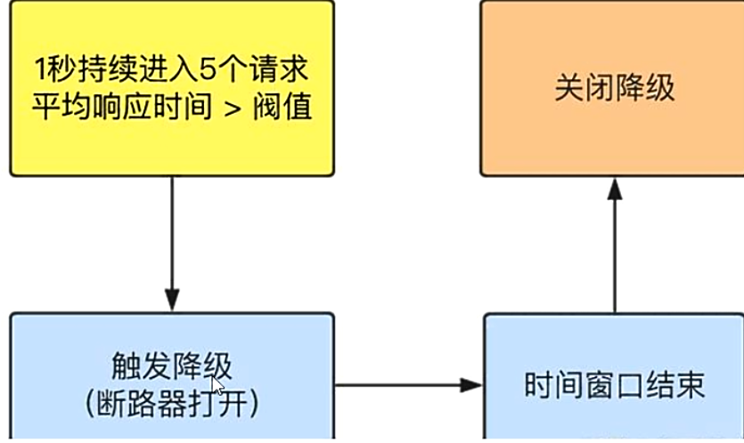
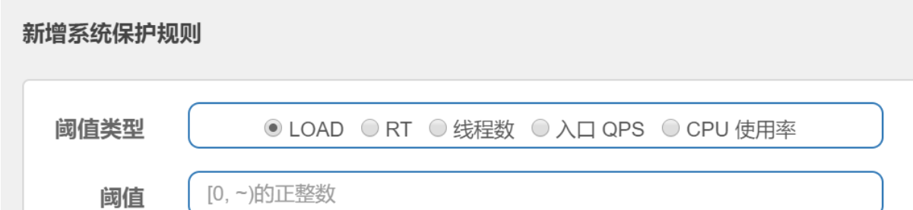

# **Sentinel**

## 简介

> 一句话解释，之前我们讲解过的 Hystrix

官网：https://github.com/alibaba/Sentinel

中文：https://github.com/alibaba/Sentinel/wiki/%E4%BB%8B%E7%BB%8D

[怎么玩](https://spring-cloud-alibaba-group.github.io/github-pages/greenwich/spring-cloud-alibaba.html#_spring_cloud_alibaba_sentinel)

> 微服务使用中的各种问题

- 服务雪崩
- 服务降级
- 服务熔断
- 服务限流


> Sentinel 组成

- 后台
- 前台 8080


> 安装步骤

- https://github.com/alibaba/Sentinel/releases
- java 环境OK
- 8080 端口不能被占用
- 启动：java -jar sentinel-dashboard-1.7.0.jar 
- 访问：http://localhost:8080
- 登录账号密码均为sentinel

> **初始化演示工程**

前戏：

- ​	启动 nacos
- ​	启动 Sentinel

模块：

- ​	cloudalibaba-sentinel-service8401
- ​	POM

```xml
<!--SpringCloud ailibaba nacos -->
<dependency>
    <groupId>com.alibaba.cloud</groupId>
    <artifactId>spring-cloud-starter-alibaba-nacos-discovery</artifactId>
</dependency>
<!--SpringCloud ailibaba sentinel-datasource-nacos 后续做持久化用到-->
<dependency>
    <groupId>com.alibaba.csp</groupId>
    <artifactId>sentinel-datasource-nacos</artifactId>
</dependency>
<!--SpringCloud ailibaba sentinel -->
<dependency>
    <groupId>com.alibaba.cloud</groupId>
    <artifactId>spring-cloud-starter-alibaba-sentinel</artifactId>
</dependency>
```

- YML

  ```yaml
  server:
    port: 8401
  
  spring:
    application:
      name: cloudalibaba-sentinel-service
    cloud:
      nacos:
        discovery:
          server-addr: localhost:8848 #Nacos服务注册中心地址
      sentinel:
        transport:
          dashboard: localhost:8080 #配置Sentinel dashboard地址
          port: 8719
  
  management:
    endpoints:
      web:
        exposure:
          include: '*'主启动类
  ```

- 主启动类

- 业务类

- ```java
  @RestController
  @Slf4j
  public class FlowLimitController {
      @GetMapping("/testA")
      public String testA() {
          return "------testA";
      }
  
      @GetMapping("/testB")
      public String testB() {
          log.info(Thread.currentThread().getName() + "\t" + "...testB");
          return "------testB";
      }
  }
  ```

  启动微服务 8401

  访问请求，刷新 Sentinel，可以在控制台看到此请求

  Sentinel 只有在访问过一次请求后，才可以在控制台看到

---

## 流控

> 基本介绍

Sentinel 后台的仪表盘功能

字段说明：

- ​		资源名：唯一名称，默认请求路径
- ​		针对来源：Sentinel 可以针对调用者进行限流，填写微服务名，默认 default（不区分来源）
-  		阈值类型/单机阈值
  - QPS（Queries-per-second，每秒钟的请求数量）：当调用该 api 的 QPS 达到阈值的时候，进行限流
  - 线程数：当调用该 api 的线程数达到阈值的时候，进行限流
- 是否集群：不需要集群
- 流控模式：
  - 直接：api达到限流条件时，直接限流
  - 关联：当关联的资源达到阈值时，就限流自己
  - 链路：只记录指定链路上的流量（指定资源从入口资源进来的流量，如果达到阈值，就进行限流）【api 级别的针对来源 】
- 流控效果：
  - 快速失败：直接失败，抛异常
  - Warm Up：根据 codeFactor（冷加載因子，默认3）的值，从阈值/codefactor，经过预热时长，才达到设置的 QPS 阈值
  - 排队等待：匀速排队，让请求以匀速的速度通过，阈值类型必须设置为 QPS，否则无效


#### 流控模式

**直接（默认）**

QPS、直接、快速失败


单机阈值：如果阈值为1，每秒查询一次OK，超过直接失败

测试：快点点击请求，结果：Blocked by Sentinel (flow limiting)

> 思考？？

直接默认错误，技术上可以但是是否应该给与后续处理

类似于 fallback 兜底的方法


#### 关联

当关联的资源达到阈值时，就限流自己，当与A关联的资源B达到阈值后，就限流自己。B惹事，A挂了。

支付炸了，订单也会炸

配置：


postman模拟并发密集访问testB，大批量线程高并发访问B，导致A失效了


#### 链路

多个请求调用了同一个微服务

todo...


#### 流控

公式：阈值除以coldFactor（默认值为3），经过预热时长后才会达到阈值

​	[wiki]([https://github.com/alibaba/Sentinel/wiki/%E6%B5%81%E9%87%8F%E6%8E%A7%E5%88%B6](https://github.com/alibaba/Sentinel/wiki/流量控制))


刚开始大量访问不行，慢慢进入状态

应用场景：秒杀系统在开启的瞬间，会有很多流量上来，可能直接把系统打死，预热是为了保护系统，可慢慢将流量放进来，慢慢把阈值增长到设置的阈值


#### 排队等待

匀速排队，阈值必须设置为 QPS


[wiki](https://github.com/alibaba/Sentinel/wiki/%E6%B5%81%E9%87%8F%E6%8E%A7%E5%88%B6#%E5%8C%80%E9%80%9F%E6%8E%92%E9%98%9F)

源码：com.alibaba.csp.sentinel.slots.block.flow.controller.RateLimiterController


## 降级

> 降级规则

[Github Wiki]([https://github.com/alibaba/Sentinel/wiki/%E7%86%94%E6%96%AD%E9%99%8D%E7%BA%A7](https://github.com/alibaba/Sentinel/wiki/熔断降级))

Sentinel 熔断降级会在调用链路中某个资源出现不稳定状态时（例如调用超时或异常比例过高），对这个资源的调用进行限制让其快速失败，避免影响到其它资源而导致级联错误。

资源被降级后，一段时间窗口之内，对该资源的调用都自动熔断(默认抛出 DegradeException)


Sentinel的断路器是没有半开状态的。

半开的状态系统自动去检测是否请求有异常，没有异常就关闭断路器恢复使用，有异常则继续打开断路器不可用。具体可以参考Hystrix


> 降级策略实战

#### RT

平均响应时间 (`DEGRADE_GRADE_RT`)：当 1s 内持续进入 N 个请求，对应时刻的平均响应时间（秒级）均超过阈值（`count`，以 ms 为单位），那么在接下的时间窗口（`DegradeRule` 中的 `timeWindow`，以 s 为单位）之内，对这个方法的调用都会自动地熔断（抛出 `DegradeException`）。注意 Sentinel 默认统计的 RT 上限是 4900 ms，**超出此阈值的都会算作 4900 ms**，若需要变更此上限可以通过启动配置项 `-Dcsp.sentinel.statistic.max.rt=xxx` 来配置。



配置


解释：希望在200毫秒内处理完请求，没有处理完在未来1s的窗口期内断路器打开保险闸微服务不可用，保险丝跳闸断电。后续请求量下去了，断路器关闭微服务启动OK


#### 异常比例

异常比例 (`DEGRADE_GRADE_EXCEPTION_RATIO`)：当资源的每秒请求量 >= N（可配置），并且每秒异常总数占通过量的比值超过阈值（`DegradeRule` 中的 `count`）之后，资源进入降级状态，即在接下的时间窗口（`DegradeRule` 中的 `timeWindow`，以 s 为单位）之内，对这个方法的调用都会自动地返回。异常比率的阈值范围是 `[0.0, 1.0]`，代表 0% - 100%。


微服务的请求量比例超过20%，进入1秒时间窗口期，崩


#### 异常数

异常数 (`DEGRADE_GRADE_EXCEPTION_COUNT`)：当资源近 1 分钟的异常数目超过阈值之后会进行熔断。注意由于统计时间窗口是**分钟级别**的，若 `timeWindow` 小于 60s，则结束熔断状态后仍可能再进入熔断状态。


1分钟内异常数量达到5(指定的)会进行熔断


## 热点参数限流

[Github Wiki](https://github.com/alibaba/Sentinel/wiki/热点参数限流)

何为热点？热点即经常访问的数据。很多时候我们希望统计某个热点数据中访问频次最高的 Top K 数据，并对其访问进行限制。

Sentinel 利用 LRU 策略统计最近最常访问的热点参数，结合**令牌桶算法**来进行参数级别的流控。热点参数限流支持集群模式。

`@SentinelResource` 兜底方法：系统默认 And 用户自定义

> 注：只处理违规配置，不处理代码异常


源码：com.alibaba.csp.sentinel.slots.block.BlockException


#### 配置：

```java
@SentinelResource(value = "testHotKey")
```

异常打到了前台用户界面看不到，不友好

```java
@SentinelResource(value = "testHotKey",blockHandler = "deal_testHotKey")
```

自定义：方法testHostKey里面第一个参数只要QPS超过每秒1次，马上降级处理


参数例外项

热点参数的注意点，参数必须是基本类型或者String

特殊情况

- 普通

  超过1秒钟一个后，达到阈值1后马上被限流

- 我们期望p1参数当它是某个特殊值时，它的限流值和平时不一样

- 特例

  假如当p1的值等于5时，它的阈值可以达到200


## 系统规则

[Github Wiki]([https://github.com/alibaba/Sentinel/wiki/%E7%B3%BB%E7%BB%9F%E8%87%AA%E9%80%82%E5%BA%94%E9%99%90%E6%B5%81](https://github.com/alibaba/Sentinel/wiki/系统自适应限流))

Sentinel 系统自适应限流从整体维度对应用入口流量进行控制，结合应用的 Load、CPU 使用率、总体平均 RT、入口 QPS 和并发线程数等几个维度的监控指标，通过自适应的流控策略，让系统的入口流量和系统的负载达到一个平衡，让系统尽可能跑在最大吞吐量的同时保证系统整体的稳定性。


参数说明

系统规则支持以下的模式：

- **Load 自适应**（仅对 Linux/Unix-like 机器生效）：系统的 load1 作为启发指标，进行自适应系统保护。当系统 load1 超过设定的启发值，且系统当前的并发线程数超过估算的系统容量时才会触发系统保护（BBR 阶段）。系统容量由系统的 `maxQps * minRt` 估算得出。设定参考值一般是 `CPU cores * 2.5`。
- **CPU usage**（1.5.0+ 版本）：当系统 CPU 使用率超过阈值即触发系统保护（取值范围 0.0-1.0），比较灵敏。
- **平均 RT**：当单台机器上所有入口流量的平均 RT 达到阈值即触发系统保护，单位是毫秒。
- **并发线程数**：当单台机器上所有入口流量的并发线程数达到阈值即触发系统保护。
- **入口 QPS**：当单台机器上所有入口流量的 QPS 达到阈值即触发系统保护。




## @SentinelResource

#### 按资源名称限流+后续处理

blockHandler : 兜底的方法

```java
@GetMapping("/byResource")
@SentinelResource(value = "byResource", blockHandler = "handleException")
public CommonResult byResource() {
    return new CommonResult(200, "按资源名称限流测试OK", new Payment(2020L, "serial001"));
}

public CommonResult handleException(BlockException exception) {
    return new CommonResult(444, exception.getClass().getCanonicalName() + "\t 服务不可用");
}
```


#### 按照Url地址限流+后续处理

此处会走系统提供的处理

```java
@GetMapping("/rateLimit/byUrl")
@SentinelResource(value = "byUrl")
public CommonResult byUrl() {
    return new CommonResult(200, "按url限流测试OK", new Payment(2020L, "serial002"));
}
```

#### 上面兜底方法面临的问题

1. **系统默认的**，没有体现我们自己的业务要求。
2. 依照现有条件，我们自定义的处理方法又和业务**代码耦合**在一块，不直观。
3. 每个业务方法都添加一个兜底的，**代码膨胀**加剧。
4. **全局统一的处理方法没有体现**


> 注：sentinel blockHandler 配置：对URL地址配置，那么是走系统默认处理。对资源名配置，可以走自定义(前提提供了)

---


#### 客户自定义限流处理逻辑

1. 创建 `CustomerBlockHandler` 类用于自定义限流处理逻辑

   **必须是 static 方法**

   ```java
   public class CustomerBlockHandler {
       public static CommonResult handlerException2(BlockException exception) {
           return new CommonResult(4444, "按客戶自定义,global handlerException----2");
       }
   }
   ```

2. 业务类中使用

   blockHandlerClass：指定处理类

   blockHandler：指定处理方法

   ```java
   @GetMapping("/rateLimit/customerBlockHandler")
   @SentinelResource(value = "customerBlockHandler", blockHandlerClass = CustomerBlockHandler.class, blockHandler = "handlerException2")
   public CommonResult customerBlockHandler() {
       return new CommonResult(200, "按客戶自定义", new Payment(2020L, "serial003"));
   }
   ```

3. 测试限流

#### 更多注解属性说明

[GitHub Wiki](https://github.com/alibaba/Sentinel/wiki/注解支持)

Sentinel 主要有三个核心 API：

-  SphU 定义资源
- Tracer 定义统计
- ContextUtil 定义了上下文


## 服务熔断功能

sentinel整合ribbon+openFeign+fallback

#### Ribbon系列

1. Module

   - 生产者：cloudalibaba-provider-payment9003、cloudalibaba-provider-payment9004
   - 消费者：cloudalibaba-consumer-nacos-order84

2. 测试 `@SentinelResource` 注解的 `fallback` 和 `blockHandler` 属性

   `fallback` 管代码异常，无 `blockHandler` 时，也管配置违规

   `blockHandler` 管配置违规

   `exceptionsToIgnore` 忽略异常

3. ```java
   @RequestMapping("/consumer/fallback/{id}")
   // @SentinelResource(value = "fallback") 
   // @SentinelResource(value = "fallback", fallback = "handlerFallback") 
   //@SentinelResource(value = "fallback",blockHandler = "blockHandler") 
   // @SentinelResource(value = "fallback", fallback = "handlerFallback", blockHandler = "blockHandler")
   // @SentinelResource(value = "fallback", fallback = "handlerFallback", blockHandler = "blockHandler", exceptionsToIgnore = {IllegalArgumentException.class})
   public CommonResult<Payment> fallback(@PathVariable Long id) {
       CommonResult<Payment> result = restTemplate.getForObject(SERVICE_URL + "/paymentSQL/" + id, CommonResult.class, id);
   
       if (id == 4) {
           throw new IllegalArgumentException("IllegalArgumentException,非法参数异常....");
       } else if (result.getData() == null) {
           throw new NullPointerException("NullPointerException,该ID没有对应记录,空指针异常");
       }
   
       return result;
   }
   
   //本例是fallback
   public CommonResult handlerFallback(@PathVariable Long id, Throwable e) {
       Payment payment = new Payment(id, "null");
       return new CommonResult<>(444, "兜底异常handlerFallback,exception类型=" + e.getClass().getCanonicalName() + ",exception内容  " + e.getMessage(), payment);
   }
   
   //本例是blockHandler
   public CommonResult blockHandler(@PathVariable Long id, BlockException blockException) {
       Payment payment = new Payment(id, "null");
       return new CommonResult<>(445, "blockHandler-sentinel限流,无此流水: blockException  " + blockException.getMessage(), payment);
   }
   ```

4. @SentinelResource(value = "fallback")

   出现错误页面

5. @SentinelResource(value = "fallback",fallback = "handlerFallback")

   管运行异常

   不会出现错误页面，加上流控规则后，违反规则后，会调用 `handlerFallback` 方法，但是异常类型为 `com.alibaba.csp.sentinel.slots.block.flow.FlowException`

6. @SentinelResource(value = "fallback",blockHandler = "blockHandler")

   不管运行异常，只管配置违规

7. **@SentinelResource(value = "fallback", fallback = "handlerFallback", blockHandler = "blockHandler")**

   `fallback` 管运行异常

   `blockHandler` 管配置违规

8. **@SentinelResource(value = "fallback", fallback = "handlerFallback", blockHandler = "blockHandler",** exceptionsToIgnore = {IllegalArgumentException.class})

   `fallback` 管运行异常，其中不管 `IllegalArgumentException`

   `blockHandler` 管配置违规


#### Feign系列

1. YML

   ```yaml
   feign:
     sentinel:
       enabled: true
   ```

2. Feign 服务接口

   ```java
   @FeignClient(value = "nacos-payment-provider", fallback = PaymentFallbackService.class)
   public interface PaymentService {
       @GetMapping(value = "/paymentSQL/{id}")
       public CommonResult<Payment> paymentSQL(@PathVariable("id") Long id);
   }
   ```

3. Feign 服务接口的 fallback 实现类

   ```java
   @Component
   public class PaymentFallbackService implements PaymentService {
       @Override
       public CommonResult<Payment> paymentSQL(Long id) {
           return new CommonResult<>(44444, "服务降级返回,---PaymentFallbackService", new Payment(id, "errorSerial"));
       }
   }
   ```

4. 主启动：`@EnableFeignClients`

5. 测试

   关闭生产者应用，访问服务，发现返回的是 fallback 实现类中的响应


#### 熔断框架比较

|                | Sentinel                                                   | Hystrix                 | Resilience4j                     |
| -------------- | ---------------------------------------------------------- | ----------------------- | -------------------------------- |
| 隔离策略       | 信号量隔离（并发线程数限流）                               | 线程池隔离/信号量隔离   | 信号量隔离                       |
| 熔断降级策略   | 基于响应时间、异常比率、异常数                             | 基于异常比率            | 基于异常比率、响应时间           |
| 实时统计实现   | 滑动窗口（Leaparray）                                      | 滑动窗口（基于 RxJava） | Ring Bit Buffer                  |
| 动态规则配置   | 支持多种数据源                                             | 支持多种数据源          | 有限支持                         |
| 扩展性         | 多个扩展点                                                 | 插件的形式              | 接口的形式                       |
| 限流           | 基于QPS，支持基于调用关系的限流                            | 有限的支持              | Rate Limiter                     |
| 流量整形       | 支持预热模式、匀速器模式、预热排队模式                     | 不支持                  | 简单的 Rate Limiter 模式         |
| 系统自适应保护 | 支持                                                       | 不支持                  | 不支持                           |
| 控制台         | 提供开箱即用的控制台，可配置规则、查看秒级监控、机器发现等 | 简单的监控查看          | 不提供控制台，可对接其他监控系统 |

## 规则持久化

[ Github Wiki]([https://github.com/alibaba/Sentinel/wiki/%E5%8A%A8%E6%80%81%E8%A7%84%E5%88%99%E6%89%A9%E5%B1%95](https://github.com/alibaba/Sentinel/wiki/动态规则扩展))

一旦我们重启应用，Sentinel规则将消失，生产环境需要将配置规则进行持久化

使用：

将限流配置规则持久化进Nacos保存，只要刷新8401某个rest地址，sentinel控制台的流控规则就能看到，只要Nacos里面的配置不删除，针对8401上Sentinel上的流控规则持续有效


```xml
<dependency>
    <groupId>com.alibaba.csp</groupId>
    <artifactId>sentinel-datasource-nacos</artifactId>
</dependency>
 
```

```yaml
spring:
  application:
    name: cloudalibaba-sentinel-service
  cloud:
    nacos:
      discovery:
        server-addr: localhost:8848 #Nacos服务注册中心地址
    sentinel:
      transport:
        dashboard: localhost:8080 #配置Sentinel dashboard地址
        port: 8719
      datasource:
        ds1:
          nacos:
            server-addr: localhost:8848
            dataId: cloudalibaba-sentinel-service
            groupId: DEFAULT_GROUP
            data-type: json
            rule-type: flow
```

在 Nacos 中添加配置，dataId 为 cloudalibaba-sentinel-service，groupId 为 DEFAULT_GROUP，配置内容为：

```json
[
    {
        "resource": "/ratelimit/byUrl",
        "limitapp": "default",
        "grade": 1,
        "count": 5,
        "strategy": 0,
        "controlBehavior": 0,
        "clustermode": false
    }
]
```

 resource：资源名称；

 limitapp：来源应用；

 grade：阈值类型，0 表示线程数，1 表示QPS；

 count：单机阈值；

 strategy：流控模式，0 表示直接，1 表示关联，2 表示链路；

 controlBehavior：流控效果，0 表示快速失败，1表示 Warm Up，2 表示排队等待；

 clusterMode：是否集群；

重启 8401，访问 http://localhost:8401/rateLimit/byUrl，查看 Sentinel 流控规则中存在 Nacos 中配置的规则


