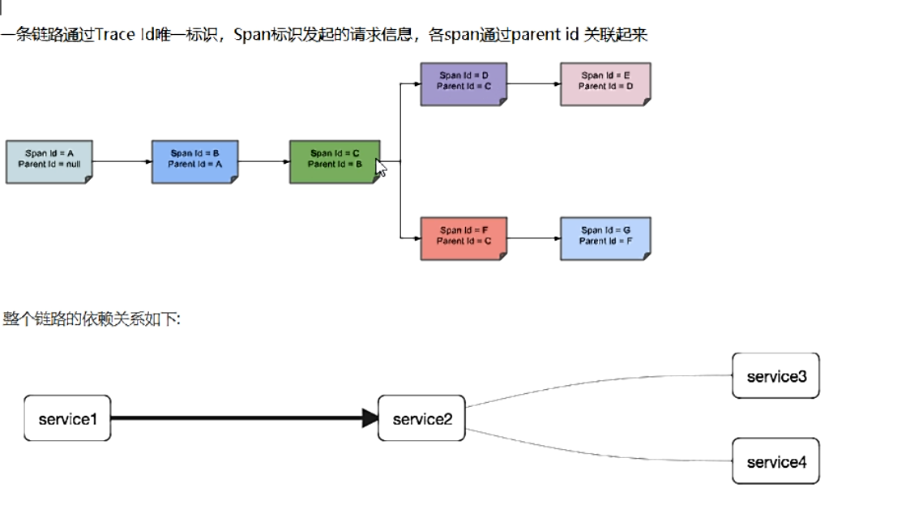

# Sleuth

> 分布式请求链路追踪

在微服务框架中，一个由客户端发起的请求在后端系统中会经过多个不同的的服务节点调用来协同产生最后的请求结果，每个前段请求都会形成一条复杂的分布式服务调用链路，链路中的任何一环出现高延时或错误都会引起整个请求最后的失败。


Spring Cloud Sleuth 提供了一套完整的服务跟踪的解决方案

Github：https://github.com/spring-cloud/spring-cloud-sleuth

在分布式系统中提供追踪解决方案并且兼容支持了 Zipkin


**关注的是服务之间的调用链的关系**

## 搭建链路监控步骤

zipkin

下载：SpringCloud从F版起已不需要自己构建Zipkin server了，只需要调用jar包即可

zipkin-server-2.12.9.exec.jar ：https://dl.bintray.com/openzipkin/maven/io/zipkin/java/zipkin-server/

运行jar：java -jar ...

访问：http://localhost:9411/zipkin/

术语：

​	完整的调用链路：表示一条请求链路，一条链路通过 Trace ld 唯一标识，Span 标识发起的请求信息，各 Span 通  	过 parent id 关联起来



​	名词解释：

​	Trace: 类似于树结构的 Span 集合，表示一条调用链路，存在唯一标识

​	Span: 表示调用链路来源，通俗的理解 Span 就是一次请求信息


### 服务提供则

POM

```xml
<dependency>
    <groupId>org.springframework.cloud</groupId>
    <artifactId>spring-cloud-starter-zipkin</artifactId>
</dependency>
```

YML

```yaml
spring:
  zipkin:
    base-url: http://localhost:9411
  sleuth:
    sampler:
    #采样率值介于 0 到 1 之间，1 则表示全部采集
    probability: 1
```

业务类 PaymentController：例如

```java
@GetMapping("/payment/zipkin")
public String paymentZipkin() {
    return "hi ,i'am paymentzipkin server fall back，welcome to atguigu，O(∩_∩)O哈哈~";
}
```


### 服务消费者（调用方）

1. POM，同上

2. YML，同上

3. 业务类 OrderControlle

   ```java
   @GetMapping("/consumer/payment/zipkin")
   public String paymentZipkin() {
       String result = restTemplate.getForObject(PAYMENT_URL + "/payment/zipkin/", String.class);
       return result;
   }
   ```

   

   测试：

   1. 启动 eureka7001、8001、80
   2. 调用消费者，http://localhost/consumer/payment/zipkin
   3. 查看 Zipkin，http://localhost:9411/zipkin/


