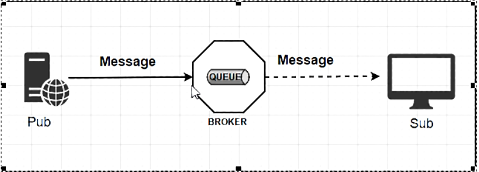
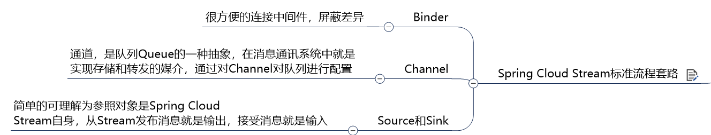
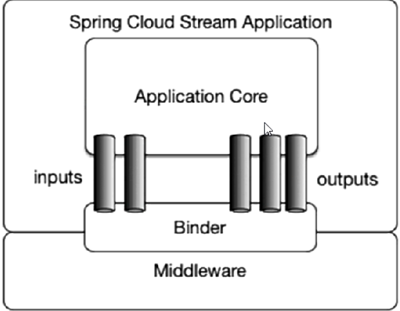
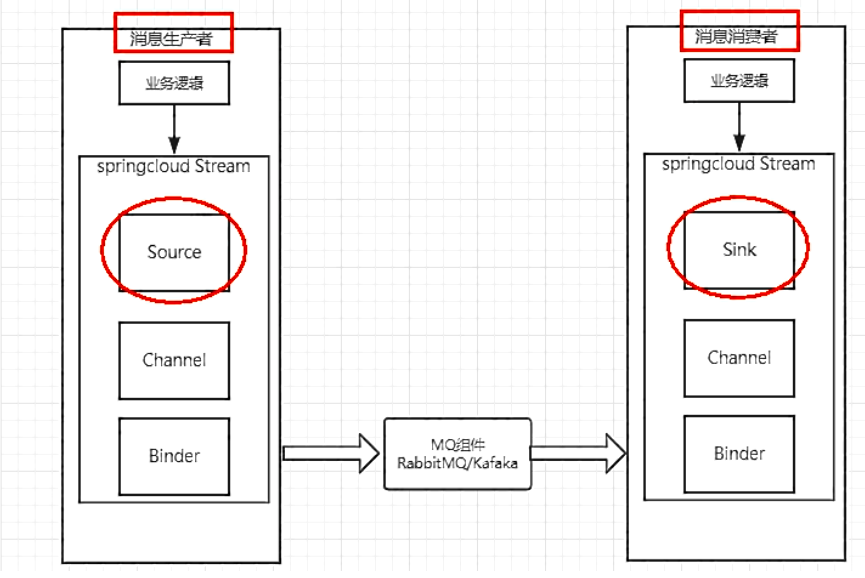
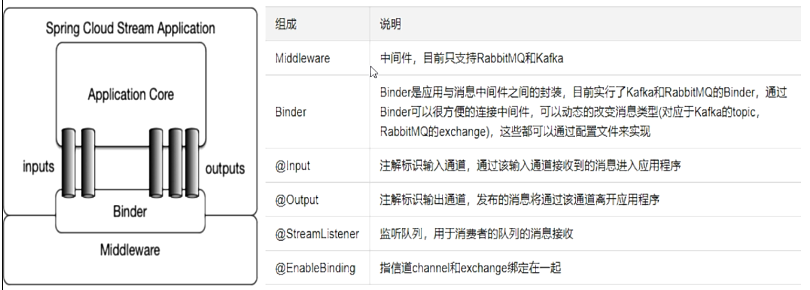

# Stream

## 简介

> 消息驱动概述

屏蔽底层消息中间件的差异，降低切换版本，统一消息的编程模型。

应用程序通过 inputs 或者 outputs 来与 Spring Cloud Stream 中 binder 对象交互。

通过我们配置来 binding（绑定），而 Spring Cloud Stream 的 binder 对象负责与消息中间件交互。

通过使用 Spring Integration 来连接消息代理中间件以实现消息事件驱动。

> 官网

[Spring Cloud Stream 官网](https://spring.io/projects/spring-cloud-stream#overview)

https://cloud.spring.io/spring-cloud-static/spring-cloud-stream/3.0.1.RELEASE/reference/html/

[中文指导手册](https://m.wang1314.com/doc/webapp/topic/20971999.html)

Spring Cloud Stream 为一些供应商的消息中间件产品提供了个性化的自动化配置实现，引用了**发布-订阅**、**消费组**、**分区**的三个核心概念。


**目前仅支持 RabbitMQ、Kafka。**

> 设计思想



上面是标准的MQ图

- 生产者/消费者之间靠**消息**媒介传递信息内容——Message

- 消息必须走特定的**通道**——消息通道 `MessageChannel`

- 消息通道里的消息如何被消费呢，谁负责收发**处理**——消息通道`MessageChannel`的子接口`SubscribableChannel`，由`MessageHandler`消息处理器订阅

  

### 为什么用Cloud Stream

市面上常用的MQ有好几种，每种架构都不同。这些差异性导致开发造成一定的困难，如果后期要对消息队列进行技术迁移这无疑是一个灾难，一大堆东西都需要推倒重做，因为它与系统耦合了，这时候Spring Cloud 给我们提供一种解耦的方式。

在没有绑定器这个概念的情況下，我们的 Spring Boot 应用要直接与消息中间件进行信息交互的时侯，由于各消息中间件构建的初衷不同，它们的实现细节上会有较大的差异性。

通过定义绑定器作为中间层，完美地实现了**应用程序与消息中间件细节之间的隔离**。通过向应用程序暴露统一的 Channel 通道，使得应用程序不需要再考虑各种不同的消息中间件实现。

**通过定义绑定器 Binder 作为中间层，实现了应用程序与消息中间件细节之间的隔离。**


##### Binder

- INPUT 对应于消费者
- OUTPUT对应于生产者

Stream对消息中间件的进一步封装，可以做到代码层面对中间件的无感知,甚至于动态的切换中间件（RabbitMQ 切换为 Kafka），使得微服务开发的高度解耦，服务可以关注更多自己的业务流程。


Stream中的消息通信方式遵循了发布-订阅模式

Topic主题进行广播

- ​	在RabbitMQ就是Exchange
- ​	在kafka中就是Topic









### 编码API和常用注解




## 例子

### 准备

消息队列环境OK

Module：生产者进行发消息，消息接收信息


### 消息驱动之生产者

- Module，cloud-stream-rabbitmq-provider8801

- POM

  ```xml
  <dependency>
      <groupId>org.springframework.cloud</groupId>
      <artifactId>spring-cloud-starter-stream-rabbit</artifactId>
  </dependency>
  ```

- YML

  ```yaml
  server:
    port: 8801
  
  spring:
    application:
      name: cloud-stream-provider
    cloud:
      stream:
        binders: # 在此处配置要绑定的rabbitmq的服务信息；
          defaultRabbit: # 表示定义的名称，用于于binding整合
            type: rabbit # 消息组件类型
            environment: # 设置rabbitmq的相关的环境配置
              spring:
                rabbitmq:
                  host: localhost
                  port: 5672
                  username: guest
                  password: guest
        bindings: # 服务的整合处理
          output: # 这个名字是一个通道的名称
            destination: studyExchange # 表示要使用的Exchange名称定义
            content-type: application/json # 设置消息类型，本次为json，文本则设置“text/plain”
            binder: defaultRabbit  # 设置要绑定的消息服务的具体设置
  
  eureka:
    client: # 客户端进行Eureka注册的配置
      service-url:
        defaultZone: http://localhost:7001/eureka
    instance:
      lease-renewal-interval-in-seconds: 2 # 设置心跳的时间间隔（默认是30秒）
      lease-expiration-duration-in-seconds: 5 # 如果现在超过了5秒的间隔（默认是90秒）
      instance-id: send-8801.com  # 在信息列表时显示主机名称
      prefer-ip-address: true     # 访问的路径变为IP地址
  
  ```

  主启动类

  业务类

  ```java
  @EnableBinding(Source.class) //定义消息的推送管道
  public class MessageProviderImpl implements IMessageProvider {
      @Resource
      private MessageChannel output; // 消息发送管道
  
      @Override
      public String send() {
          String serial = UUID.randomUUID().toString();
          output.send(MessageBuilder.withPayload(serial).build());
          System.out.println("*****serial: " + serial);
          return null;
      }
  }
  ```

  测试

  1. 启动7001eureka

  2. 启动rabbitmq

     ```
     http://localhost:15672/
     ```

  3. 启动 生产者

  4. 访问 http://localhost:8801/sendMessage

  5. 查看 RabbitMQ 中 Exchanges 的 studyExchange 出现波动


### 消息驱动之消费者

- 消费者Module，eg: cloud-stream-rabbitmq-consumer8802 
- POM，同生产者
- YML

```yaml
server:
  port: 8802

spring:
  application:
    name: cloud-stream-provider
  cloud:
    stream:
      binders: # 在此处配置要绑定的rabbitmq的服务信息；
        defaultRabbit: # 表示定义的名称，用于于binding整合
          type: rabbit # 消息组件类型
          environment: # 设置rabbitmq的相关的环境配置
            spring:
              rabbitmq:
                host: localhost
                port: 5672
                username: guest
                password: guest
      bindings: # 服务的整合处理
        input: # 这个名字是一个通道的名称
          destination: studyExchange # 表示要使用的Exchange名称定义
          content-type: application/json # 设置消息类型，本次为json，文本则设置“text/plain”
          binder: defaultRabbit  # 设置要绑定的消息服务的具体设置
#          group: KI-G

eureka:
  client: # 客户端进行Eureka注册的配置
    service-url:
      defaultZone: http://localhost:7001/eureka

```

主启动类

业务类

```java
@Component
@EnableBinding(Sink.class)
public class ReceiveMessageListenerController {
    @Value("${server.port}")
    private String serverPort;


    @StreamListener(Sink.INPUT)
    public void input(Message<String> message) {
        System.out.println("消费者1号,----->接受到的消息: " + message.getPayload() + "\t  port: " + serverPort);
    }
}
```

测试

1. 启动注册中心 Eureka7001、Stream 生产者 cloud-stream-rabbitmq-provider8801、Stream 消费者 cloud-stream-rabbitmq-consumer8802
2. 访问 http://localhost:8801/sendMessage，向 RabbitMQ 发送消息
3. 查看控制台，Stream 消费者接收到消息


## 分组消费与持久化

> 存在问题

重复消费问题，生产者发送消息后消费都受到了消息，消息持久化问题

### 分组消费

多数情况，生产者发送消息给某个具体微服务时只希望被消费一次，为了解决这个问题，Spring Cloud Stream 中提供了 **消费组** 的概念。重复消费问题可以使用 Stream 中的 **消息分组** 来解决。

不同组可以全面消费（重复消费），同一组内存在竞争关系，只有其中一个可以消费

导致重复消费的原因：默认分组 group 是不同的，组流水号不一样，被认为是不同组。

可以通过 RabbitMQ 查看消费者的组。

解决：

**微服务应用放置于同一个group中**，就能够保证消息只会被其中一个应用消费一次。不同的组是可以消费的，同一个组内会发生竞争关系，只有其中一个可以消费。

示例：

为多个消费者指定 **分组和持久化属性 group**

```yaml
spring.cloud.stream.bindings.input.group: GroupName
```

### 持久化

如果存在分组的微服务关闭后，生产者继续输出信息，分组内的微服务启动后会拿到新的信息，而不存在分组的微服务则不会拿到新信息。

eg：关机/退出后UP更新新的视频，如果你关注了UP(存在它的粉丝组中)，你重新上线后能接收到UP新发布的视频(信息)，但是如果你没有关注(不存在组中)，那么你不会接收到新视频的上传信息。


原因：之前指定 group 时，将组注册到了 RabbitMQ，即使停止消费者，RabbitMQ 上依然有记录这个组，发送消息时，会为这个注册了的组保留未消费的消息，指定 group 的消费者启动后，可以接着消费保留的消息。

如果将 group 从 atguigu 换成 atguiguA，此时组变了，重新启动后也不会接收到消息


