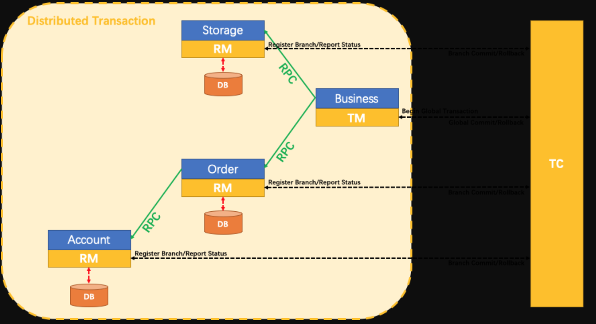

# Seata

> 分布式事务控制

### 简介

分布式中事务问题？

一次业务操作需要跨多个数据源或需要跨多个系统进行远程调用，就会产生分布式事务问题

回顾事务：一条或一组SQL的集合，要么全部成功要不全部失败

简单地说：现在是不同跨多个数据库的远程调用，本质还是要么都成功要不全部失败


Seata 是一款开源的分布式事务解决方案，致力于在微服务架构下提供高性能和简单易用的分布式事务服务。

[官网地址](http://seata.io/zh-cn/)

[下载地址](https://github.com/seata/seata/releases)

> 个人觉得还不是成熟，0.9版本对mysql8的支持，还有高版本1.0及以上有很多坑需要自填
>
> 使用倒是简单


### 一个典型的分布式事务过程

#### 分布式事务处理过程的-ID + 三组件模型

组件概念：

- Transaction Coordinator（TC）

  事务协调者，维护全局事务的运行状态，负责协调并驱动全局事务的提交或回滚;

- Transaction Manager（TM）

  事务管理器，定义全局事务的范围：开始全局事务、提交或回滚全局事务。

- Resource Manager（RM）

  资源管理器，管理分支事务处理的资源，与TC交谈以注册分支事务和报告分支事务的状态，并驱动分支事务提交或回滚。

> 

#### 处理过程

1. TM 向 TC 申请开启一个全局事务，全局事务创建成功并生成一个全局唯一的 XID
2. XID 在微服务调用链路的上下文中传播
3. RM 向 TC 注册分支事务，将其纳入 XID 对应全局事务的管辖
4. TM 向 TC 发起针对 XD 的全局提交或回滚決议
5. TC 调度 XID 下管辖的全部分支事务完成提交或回滚请求

#### 怎么玩

本地 `@Transactional`

全局 `@GlobalTransactional`


SEATA的分布式交易解决方案



### Seata-Server安装

1. [下载 Seata](https://github.com/seata/seata/tags)

2. 修改 `conf/file.conf`

   - 修改事务组名称：vgroupMapping.my_test_tx_group = "fsp_tx_group"
   - 修改事务日志存储模式为 db
   - 修改数据库连接信息

   ```conf
   
   ## transaction log store, only used in seata-server
   store {
     ## store mode: file、db
     mode = "db"
   
     ## file store property
     file {
       ## store location dir
       dir = "sessionStore"
       # branch session size , if exceeded first try compress lockkey, still exceeded throws exceptions
       maxBranchSessionSize = 16384
       # globe session size , if exceeded throws exceptions
       maxGlobalSessionSize = 512
       # file buffer size , if exceeded allocate new buffer
       fileWriteBufferCacheSize = 16384
       # when recover batch read size
       sessionReloadReadSize = 100
       # async, sync
       flushDiskMode = async
     }
   
     ## database store property
     db {
       ## the implement of javax.sql.DataSource, such as DruidDataSource(druid)/BasicDataSource(dbcp) etc.
       datasource = "dbcp"
       ## mysql/oracle/h2/oceanbase etc.
       dbType = "mysql"
       driverClassName = "com.mysql.jdbc.Driver"
       url = "jdbc:mysql://127.0.0.1:3306/seata"
       user = "root"
       password = "1234"
       minConn = 1
       maxConn = 10
       globalTable = "global_table"
       branchTable = "branch_table"
       lockTable = "lock_table"
       queryLimit = 100
     }
   }
   
   # service configuration, only used in client side
   service {
     #transaction service group mapping
     vgroupMapping.my_test_tx_group = "fsp_tx_group"
     #only support when registry.type=file, please don't set multiple addresses
     default.grouplist = "127.0.0.1:8091"
     #degrade, current not support
     enableDegrade = false
     #disable seata
     disableGlobalTransaction = false
   }
   ```

3. mysql5.7 数据库新建库 `seata`

4. 执行脚本，[sql 脚本地址](https://github.com/seata/seata/tree/develop/script/server/db)

5. 修改 `conf/registry.conf`，改为 `nacos`

   ```
   registry {
     # file 、nacos 、eureka、redis、zk、consul、etcd3、sofa
     type = "nacos"
   
     nacos {
       serverAddr = "localhost:8848"
       namespace = ""
       cluster = "default"
     }
     ...
   }
   ```

6. 启动 Nacos

7. 启动 Seata

> 注意：seata 0.9 不支持mysql 8 需要自己修改，seata 1.0以上有很多配置没有了，此处是坑

## 案例

#### 分布式事务业务说明

这里创建三个服务，一个订单服务，一个库存服务，一个账户服务当用户下单时，会在订单服务中创建一个订单，然后通过远程调用库存服务来扣减下单商品的库存再通过远程调用账户服务来扣减用户账户里面的余额，最后在订单服务中修改订单状态为已完成。

该操作跨越三个数据库,有两次远程调用，很明显会有分布式事务问题。

下订单-->扣库存-->减账户（余额）


#### 创建业务数据库、数据表

- seata_order：存储订单的数据库
  - t_order表
- seata_storage：存储库存的数据库
  - t_storage表
- seata_account：存储账户信息的数据库
  - t_account表


#### 按照上述3库分别建对应的回滚日志表

[sql 脚本地址](https://github.com/seata/seata/tree/develop/script/client/at/db)

### 订单/库存/账户业务微服务准备

业务需求：下订单->减库存->扣余额->改（订单）状态

#### 新建订单 Order-Module

1. Module，seata-order-service2001，seata-order-service2002，seata-order-service2003

2. POM

   ```xml
   <dependency>
       <groupId>com.alibaba.cloud</groupId>
       <artifactId>spring-cloud-starter-alibaba-seata</artifactId>
       <exclusions>
           <exclusion>
               <artifactId>seata-all</artifactId>
               <groupId>io.seata</groupId>
           </exclusion>
       </exclusions>
   </dependency>
   <dependency>
       <groupId>io.seata</groupId>
       <artifactId>seata-all</artifactId>
       <version>1.1.0</version>
   </dependency>
   ```

3. YML

   ```yaml
   spring:
     application:
       name: seata-order-service
     cloud:
       alibaba:
         seata:
           #自定义事务组名称需要与seata-server中的对应
           tx-service-group: fsz_tx_group
       nacos:
         discovery:
           server-addr: localhost:8848
     datasource:
       driver-class-name: com.mysql.cj.jdbc.Driver
       url: jdbc:mysql://localhost:3306/seata_order
   ```

4. file.conf，不同于 seata-server 里的 file.conf

   ```conf
   transport {
     # tcp udt unix-domain-socket
     type = "TCP"
     #NIO NATIVE
     server = "NIO"
     #enable heartbeat
     heartbeat = true
     #thread factory for netty
     thread-factory {
       boss-thread-prefix = "NettyBoss"
       worker-thread-prefix = "NettyServerNIOWorker"
       server-executor-thread-prefix = "NettyServerBizHandler"
       share-boss-worker = false
       client-selector-thread-prefix = "NettyClientSelector"
       client-selector-thread-size = 1
       client-worker-thread-prefix = "NettyClientWorkerThread"
       # netty boss thread size,will not be used for UDT
       boss-thread-size = 1
       #auto default pin or 8
       worker-thread-size = 8
     }
     shutdown {
       # when destroy server, wait seconds
       wait = 3
     }
     serialization = "seata"
     compressor = "none"
   }
   
   service {
   
     vgroup_mapping.fsp_tx_group = "default" #修改自定义事务组名称
   
     default.grouplist = "127.0.0.1:8091"
     enableDegrade = false
     disable = false
     max.commit.retry.timeout = "-1"
     max.rollback.retry.timeout = "-1"
     disableGlobalTransaction = false
   }
   
   
   client {
     async.commit.buffer.limit = 10000
     lock {
       retry.internal = 10
       retry.times = 30
     }
     report.retry.count = 5
     tm.commit.retry.count = 1
     tm.rollback.retry.count = 1
   }
   
   ## transaction log store
   store {
     ## store mode: file、db
     mode = "db"
   
     ## file store
     file {
       dir = "sessionStore"
   
       # branch session size , if exceeded first try compress lockkey, still exceeded throws exceptions
       max-branch-session-size = 16384
       # globe session size , if exceeded throws exceptions
       max-global-session-size = 512
       # file buffer size , if exceeded allocate new buffer
       file-write-buffer-cache-size = 16384
       # when recover batch read size
       session.reload.read_size = 100
       # async, sync
       flush-disk-mode = async
     }
   
     ## database store
     db {
       ## the implement of javax.sql.DataSource, such as DruidDataSource(druid)/BasicDataSource(dbcp) etc.
       datasource = "dbcp"
       ## mysql/oracle/h2/oceanbase etc.
       db-type = "mysql"
       driver-class-name = "com.mysql.jdbc.Driver"
       url = "jdbc:mysql://127.0.0.1:3306/seata"
       user = "root"
       password = "1234"
       min-conn = 1
       max-conn = 3
       global.table = "global_table"
       branch.table = "branch_table"
       lock-table = "lock_table"
       query-limit = 100
     }
   }
   lock {
     ## the lock store mode: local、remote
     mode = "remote"
   
     local {
       ## store locks in user's database
     }
   
     remote {
       ## store locks in the seata's server
     }
   }
   recovery {
     #schedule committing retry period in milliseconds
     committing-retry-period = 1000
     #schedule asyn committing retry period in milliseconds
     asyn-committing-retry-period = 1000
     #schedule rollbacking retry period in milliseconds
     rollbacking-retry-period = 1000
     #schedule timeout retry period in milliseconds
     timeout-retry-period = 1000
   }
   
   transaction {
     undo.data.validation = true
     undo.log.serialization = "jackson"
     undo.log.save.days = 7
     #schedule delete expired undo_log in milliseconds
     undo.log.delete.period = 86400000
     undo.log.table = "undo_log"
   }
   
   ## metrics settings
   metrics {
     enabled = false
     registry-type = "compact"
     # multi exporters use comma divided
     exporter-list = "prometheus"
     exporter-prometheus-port = 9898
   }
   
   support {
     ## spring
     spring {
       # auto proxy the DataSource bean
       datasource.autoproxy = false
     }
   }
   ```

5. registry.conf

   ```conf
   registry {
     # file 、nacos 、eureka、redis、zk、consul、etcd3、sofa
     type = "nacos"
   
     nacos {
       serverAddr = "localhost:8848"
       namespace = ""
       cluster = "default"
     }
     eureka {
       serviceUrl = "http://localhost:8761/eureka"
       application = "default"
       weight = "1"
     }
     redis {
       serverAddr = "localhost:6379"
       db = "0"
     }
     zk {
       cluster = "default"
       serverAddr = "127.0.0.1:2181"
       session.timeout = 6000
       connect.timeout = 2000
     }
     consul {
       cluster = "default"
       serverAddr = "127.0.0.1:8500"
     }
     etcd3 {
       cluster = "default"
       serverAddr = "http://localhost:2379"
     }
     sofa {
       serverAddr = "127.0.0.1:9603"
       application = "default"
       region = "DEFAULT_ZONE"
       datacenter = "DefaultDataCenter"
       cluster = "default"
       group = "SEATA_GROUP"
       addressWaitTime = "3000"
     }
     file {
       name = "file.conf"
     }
   }
   
   config {
     # file、nacos 、apollo、zk、consul、etcd3
     type = "file"
   
     nacos {
       serverAddr = "localhost"
       namespace = ""
     }
     consul {
       serverAddr = "127.0.0.1:8500"
     }
     apollo {
       app.id = "seata-server"
       apollo.meta = "http://192.168.1.204:8801"
     }
     zk {
       serverAddr = "127.0.0.1:2181"
       session.timeout = 6000
       connect.timeout = 2000
     }
     etcd3 {
       serverAddr = "http://localhost:2379"
     }
     file {
       name = "file.conf"
     }
   }
   ```

6. 关键业务类

```java
@Service
@Slf4j
public class OrderServiceImpl implements OrderService
{
    @Resource
    private OrderDao orderDao;
    @Resource
    private StorageService storageService;
    @Resource
    private AccountService accountService;

    /**
     * 创建订单->调用库存服务扣减库存->调用账户服务扣减账户余额->修改订单状态
     * 简单说：下订单->扣库存->减余额->改状态
     添加注解后就会有全局事务
     */
    @Override
    @GlobalTransactional(name = "fsp-create-order",rollbackFor = Exception.class)
    public void create(Order order)
    {
        log.info("----->开始新建订单");
        //1 新建订单
        orderDao.create(order);

        //2 扣减库存
        log.info("----->订单微服务开始调用库存，做扣减Count");
        storageService.decrease(order.getProductId(),order.getCount());
        log.info("----->订单微服务开始调用库存，做扣减end");

        //3 扣减账户
        log.info("----->订单微服务开始调用账户，做扣减Money");
        accountService.decrease(order.getUserId(),order.getMoney());
        log.info("----->订单微服务开始调用账户，做扣减end");

        //4 修改订单状态，从零到1,1代表已经完成
        log.info("----->修改订单状态开始");
        orderDao.update(order.getUserId(),0);
        log.info("----->修改订单状态结束");

        log.info("----->下订单结束了，O(∩_∩)O哈哈~");

    }
}
```

配置类

```java
@Configuration
public class DataSourceProxyConfig {

    @Value("${mybatis.mapperLocations}")
    private String mapperLocations;

    @Bean
    @ConfigurationProperties(prefix = "spring.datasource")
    public DataSource druidDataSource(){
        return new DruidDataSource();
    }

    @Bean
    public DataSourceProxy dataSourceProxy(DataSource dataSource) {
        return new DataSourceProxy(dataSource);
    }

    @Bean
    public SqlSessionFactory sqlSessionFactoryBean(DataSourceProxy dataSourceProxy) throws Exception {
        SqlSessionFactoryBean sqlSessionFactoryBean = new SqlSessionFactoryBean();
        sqlSessionFactoryBean.setDataSource(dataSourceProxy);
        sqlSessionFactoryBean.setMapperLocations(new PathMatchingResourcePatternResolver().getResources(mapperLocations));
        sqlSessionFactoryBean.setTransactionFactory(new SpringManagedTransactionFactory());
        return sqlSessionFactoryBean.getObject();
    }

}
```


### 测试验证

**注意**：如果使用1.1版本以上的seata组名记得用 `vgroupMapping`，1.0及之前的用 `vgroup_mapping`

1. 访问 url，http://localhost:2001/order/create?userId=1&productId=1&count=10&money=100，正常创建订单，数据库中记录正确更新

2. 测试非事务，出错的情况

   在 2001 中去掉 `@GlobalTransactional`，在 2003 中添加代码，造成超时异常

   ```java
   try { TimeUnit.SECONDS.sleep(20); } catch (InterruptedException e) { e.printStackTrace(); }
   ```

   结果为：

   创建订单，状态为失败；扣减库存；未扣减账户金额；

   当库存和账户余额扣减后，订单状态并没有设置为已经完成，没有从零改为1

   而且由于feign的重试机制，账户余额还有可能被多次扣减

3. 测试存在全局事务，出错的情况

   在 2001 中加上 `@GlobalTransactional`

   结果为：

   未创建订单；未扣减库存；未扣减账户金额；


